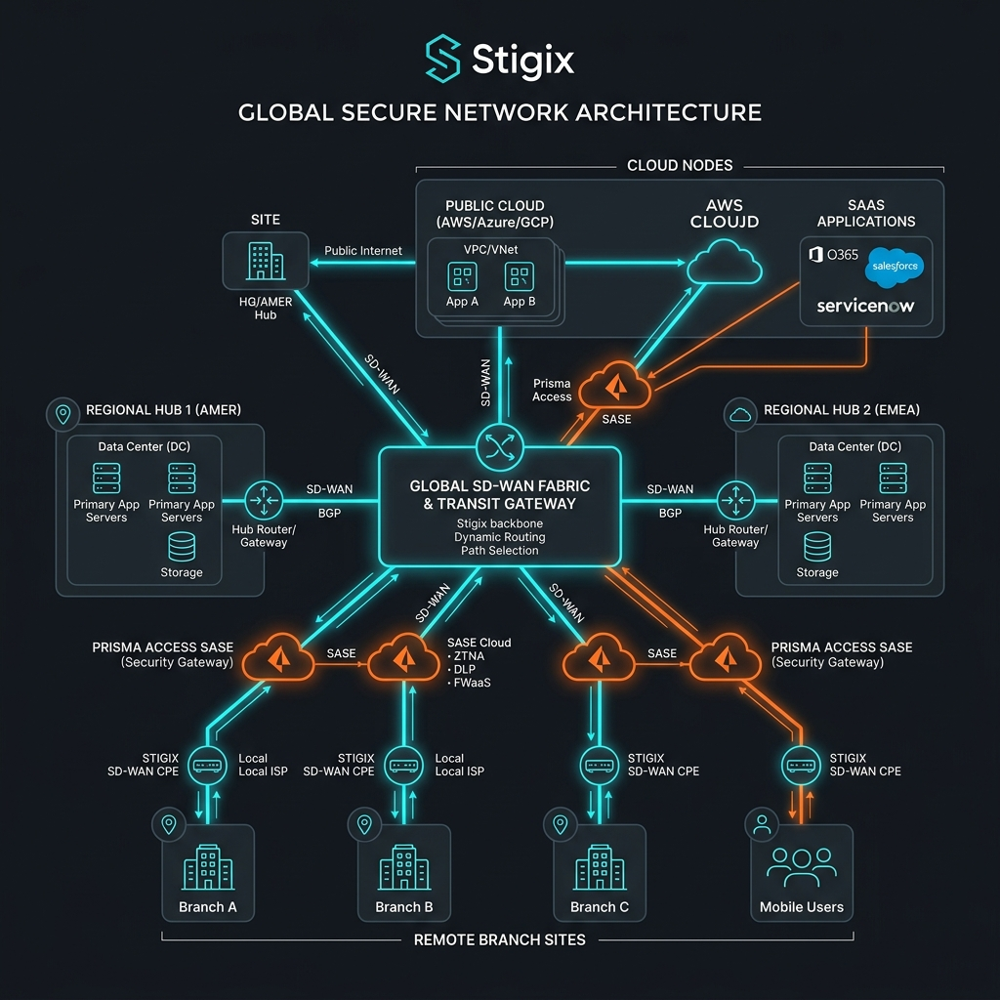
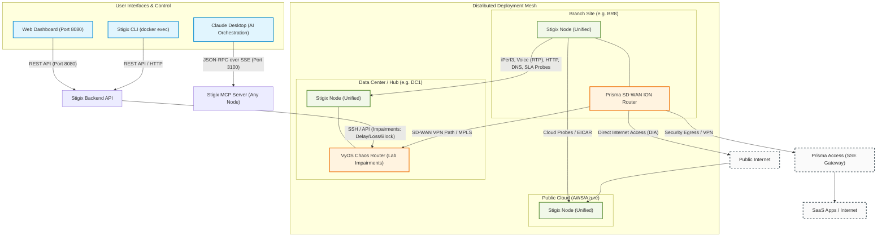

# Stigix Network & System Deployment Guide

This guide provides network and system engineers with a step-by-step blueprint for deploying **Stigix** across diverse infrastructure environments. Stigix is designed to test and validate SD-WAN path selection, security efficacy, application experience (DEM), and failover convergence.

## 🗺️ Stigix High-Level Secure Network Architecture

Below is the conceptual Global Secure Network Architecture for a Stigix deployment:



### Stigix Functional Component Diagram

The following diagram illustrates how user interfaces (Web UI, CLI, Claude Desktop via MCP) interact with Stigix instances and how those instances communicate across the network fabric and integrate with VyOS chaos routers:



---

## 🎯 1. Overview & Capabilities

Every Stigix instance is deployed in **unified mode**, meaning it acts as both a **traffic source (generator/controller)** and a **traffic target (echo responder/server)**. This eliminates the complexity of managing separate agent roles and enables bidirectional testing out-of-the-box.

### Core Capabilities:
*   **Traffic Generation**: Simulates common SaaS applications (Microsoft 365, Google Workspace, Salesforce, Zoom, etc.) using realistic HTTP patterns.
*   **Security Posture Probes**: Performs DNS security queries, URL filtering validation, and threat prevention audits (such as EICAR) to test next-generation firewalls.
*   **Experience & Latency Probes (DEM)**: Actively measures reachability, latency, jitter, and HTTP response times.
*   **High-Speed Bandwidth Testing (XFR)**: Orchestrates bandwidth throughput tests using iPerf3 / XFR protocols.
*   **Failover & Convergence Testing**: Emits high-rate UDP probes to calculate sub-second blackout times during link failovers.
*   **VoIP Simulation**: Emits periodic RTP streams to calculate Mean Opinion Score (MOS), jitter, and packet loss.

---

## 🌐 2. Deployment Typologies & Use Cases

To validate SD-WAN path steering and policy enforcement, Stigix nodes should be deployed in a distributed mesh to perform **Stigix-to-Stigix** testing.

```text
               ┌──────────────────────────────────────────┐
               │         Public Cloud (AWS/Azure)         │
               │            Stigix Node (Hub)             │
               └────────────────────┬─────────────────────┘
                                    │
                  SD-WAN VPN Path 1 │ SD-WAN VPN Path 2
                                    │
       ┌────────────────────────────┴────────────────────────────┐
       ▼                                                         ▼
┌──────────────┐          SD-WAN Hub Router              ┌──────────────┐
│  Branch A    ├─────────────────────────────────────────┤  Branch B    │
│ Stigix Node  │            Direct VPN Path              │ Stigix Node  │
└──────────────┘                                         └──────────────┘
```

### Key Use Cases:

#### 1. Branch-to-Hub (Data Center)
*   **Objective**: Validate traffic path selection (e.g., MPLS vs. Internet broadband) for business-critical applications heading to the corporate data center.
*   **Setup**: Deploy one Stigix node in the branch LAN segment and another in the core DC LAN segment behind the SD-WAN gateways. Run speedtests, VoIP simulation, and convergence tests between them.

#### 2. Branch-to-Public Cloud (AWS, Azure, GCP)
*   **Objective**: Measure Direct Internet Access (DIA) performance and Cloud Security Gateway latency (e.g., Prisma Access) for cloud workloads.
*   **Setup**: Deploy a Stigix node inside your public cloud VPC/VNet. Direct traffic from branch sites to the cloud node to audit WAN exit paths and cloud firewall policies.

#### 3. Branch-to-Branch
*   **Objective**: Validate direct peer-to-peer tunnels (Dynamic Mesh VPNs) dynamically established between remote sites by the SD-WAN fabric.
*   **Setup**: Deploy Stigix nodes at remote sites A and B, and run latency, voice, and speedtest probes directly between them.

---

## 💻 3. OS & System Requirements

Stigix runs as a containerized stack. For optimal network fidelity, your choice of Operating System and host environment is critical.

### Host Platform Options:

| Platform | Network Mode | Pro/Con | Best Suited For |
|---|---|---|---|
| **Native Linux** (Ubuntu / Debian) | **Host Mode** (`network_mode: host`) | **Pro**: Direct L2/L3 access, supports full IoT MAC spoofing and DHCP/ARP emulation, optimal UDP performance.<br>**Con**: Requires dedicated OS/VM. | **Production Branches, Hub VMs, and Cloud instances** (Recommended). |
| **Windows / macOS** (Docker Desktop) | **Bridge Mode** (NAT/Port-Mapped) | **Pro**: Easy development setup.<br>**Con**: IoT device emulation is disabled (no L2 features), ports must be manually mapped. | **Local Development, Testing, and Demos**. |

### Resource Recommendations:

*   **Small Branch (up to 20 clients simulated)**: 2 vCPUs, 2 GB RAM, 20 GB Storage (e.g., Raspberry Pi 4/5, Intel NUC, or light VM).
*   **Data Center / Hub (high-speed responder)**: 4 vCPUs, 4 GB - 8 GB RAM, 40 GB Storage (VM on ESXi, Proxmox, Hyper-V, or Cloud).

---

## 🚦 4. Network & Firewall Port Matrix

If Stigix is deployed behind firewalls or in different security zones, you must permit the following ports in your Access Control Lists (ACLs) and Security Groups.

### Port Matrix Table:

| Port | Protocol | Flow Direction | Service / Feature | Description |
|---|---|---|---|---|
| **8080** | TCP | Inbound (to Stigix) | Web Dashboard | Connects to the graphical administration dashboard. |
| **8082** | TCP | Inbound (to Stigix) | Echo Responder Web Server | Used by other Stigix nodes for HTTP/HTTPS probes and EICAR file retrieval. |
| **3100** | TCP | Inbound (to Stigix) | MCP Server (SSE) | Model Context Protocol SSE port, enabling Claude Desktop orchestration. |
| **9000** | TCP | Inbound (to Stigix) | XFR Speedtest | Dedicated port for high-speed network performance tests. |
| **5201** | TCP & UDP | Inbound (to Stigix) | iPerf3 Responder | Used for standard bandwidth and path validation tests. |
| **6100 - 6101** | UDP | Inbound (to Stigix) | VoIP RTP Echo | Used to receive and echo back voice simulation RTP streams. |
| **6200** | UDP | Inbound (to Stigix) | SLA Probes | Target port for convergence and failover packet loss monitoring. |

---

## 🚀 5. Installation & Bootstrap

Follow these steps to deploy Stigix on a clean Linux host (Ubuntu 22.04 LTS or 24.04 LTS recommended).

### Step 1: Install Docker and Docker Compose
```bash
sudo apt-get update
sudo apt-get install -y docker.io docker-compose-v2
sudo usermod -aG docker $USER
newgrp docker
```

### Step 2: Run the Install Script
Download and run the official bootstrap script:
```bash
curl -sfL https://raw.githubusercontent.com/jsuzanne/stigix/main/install.sh | bash
```
The script will auto-detect your platform, download `docker-compose.yml`, generate a random JWT secret, and configure default `.env` variables.

### Step 3: Configure the Local Site Name
Open `stigix/.env` and verify the `STIGIX_SITE_NAME` variable matches your physical branch name (e.g., `BR8` or `DC-HETZNER`):
```ini
STIGIX_SITE_NAME=BR8
```

---

## 🔐 6. Multi-Node Setup & JWT Secret Sync

In a distributed Stigix fabric, you can use Claude (via MCP) to orchestrate cross-node tests. For example, you can tell Claude: *"Run a speedtest from BR8 to DC1"*.

To allow this, the MCP server on `BR8` must authenticate its API call against `DC1` using a shared JSON Web Token. **This requires all Stigix nodes to share the exact same `JWT_SECRET`**.

```text
┌─────────────────┐             1. Signed HTTP API call             ┌─────────────────┐
│   Node A (BR8)  │ ──────────────────────────────────────────────> │   Node B (DC1)  │
│  JWT_SECRET:    │                                                 │  JWT_SECRET:    │
│  "MySharedKey"  │ <────────────────────────────────────────────── │  "MySharedKey"  │
└─────────────────┘             2. Signature verified (200 OK)      └─────────────────┘
```

> [!WARNING]
> The default install script generates a unique random `JWT_SECRET` for each node. If the secrets do not match, cross-node orchestrations will fail silently or return `status: "error"`.

### How to Synchronize the Secret:
1. Choose one node as the reference and extract its secret:
   ```bash
   cat ~/stigix/.env | grep JWT_SECRET
   ```
2. Copy this value and apply it in the `~/stigix/.env` file of all other Stigix nodes:
   ```ini
   JWT_SECRET=your-shared-secret-key-here
   ```
3. Restart the Stigix containers on each node to apply the new secret:
   ```bash
   cd ~/stigix
   docker compose restart
   ```

---

## 🛠️ 7. VyOS Router Integration

Stigix includes native integration to inject network impairments (delay, jitter, packet loss, or link flaps) on VyOS routers to test SD-WAN convergence behavior.

```text
┌──────────────┐      Impairment API Commands (SSH/HTTP)      ┌───────────────┐
│ Stigix Node  │ ───────────────────────────────────────────> │  VyOS Router  │
│ (Controller) │                                              │ (Path Impair) │
└──────────────┘                                              └───────────────┘
```

### Setup Prerequisites on VyOS:
1. Ensure the Stigix node has SSH and API access enabled to the VyOS router.
2. Configure **Interface Descriptions** on your VyOS interfaces. Stigix uses natural language matching to resolve links (e.g., *"MPLS"* or *"Internet"*):
   ```vyos
   set interfaces ethernet eth1 description "MPLS-Link-DC1"
   set interfaces ethernet eth2 description "WAN-Internet-Primary"
   ```
   *Note: Any interface without a description is treated as a management interface and is excluded from Stigix actions to prevent lockouts.*

---

## 🔍 8. Troubleshooting Deployment Issues

### Issue 1: "API login_secret returned False"
*   **Cause**: Incorrect SASE client ID, secret, or TSG ID in `.env` or `config/prisma-config.json`.
*   **Fix**: Verify your Palo Alto IAM service account credentials. If using environment variables, ensure they match:
    ```ini
    PRISMA_SDWAN_CLIENT_ID="your-client-id@tsgid.iam.panserviceaccount.com"
    PRISMA_SDWAN_CLIENT_SECRET="your-client-secret"
    PRISMA_SDWAN_TSGID="your-10-digit-tsg-id"
    ```

### Issue 2: IoT emulation or Layer 2 features not appearing
*   **Cause**: Docker is running in Bridge mode (default on macOS and Windows).
*   **Fix**: Deploy Stigix on a native Linux server (Ubuntu/Debian) to run in Host Network Mode.

### Issue 3: Cross-node speedtests returning errors
*   **Cause**: Outbound firewall blocks, or mismatched `JWT_SECRET` values.
*   **Fix**: 
    1. Ensure TCP port 9000 and UDP port 5201 are allowed inbound on the target node.
    2. Confirm both nodes print the exact same JWT secret when running:
       ```bash
       docker exec stigix printenv JWT_SECRET
       ```
