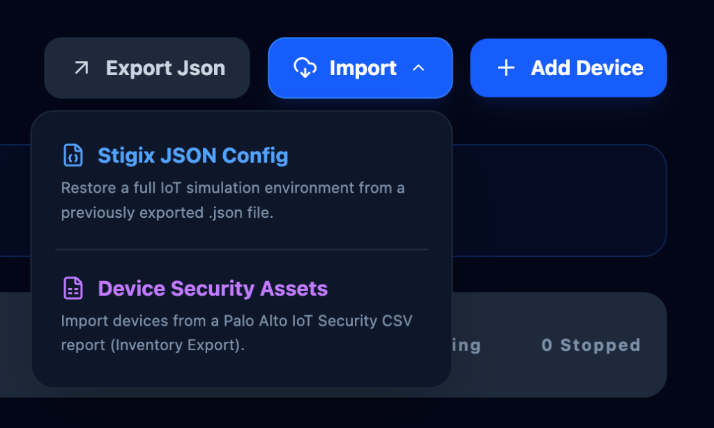
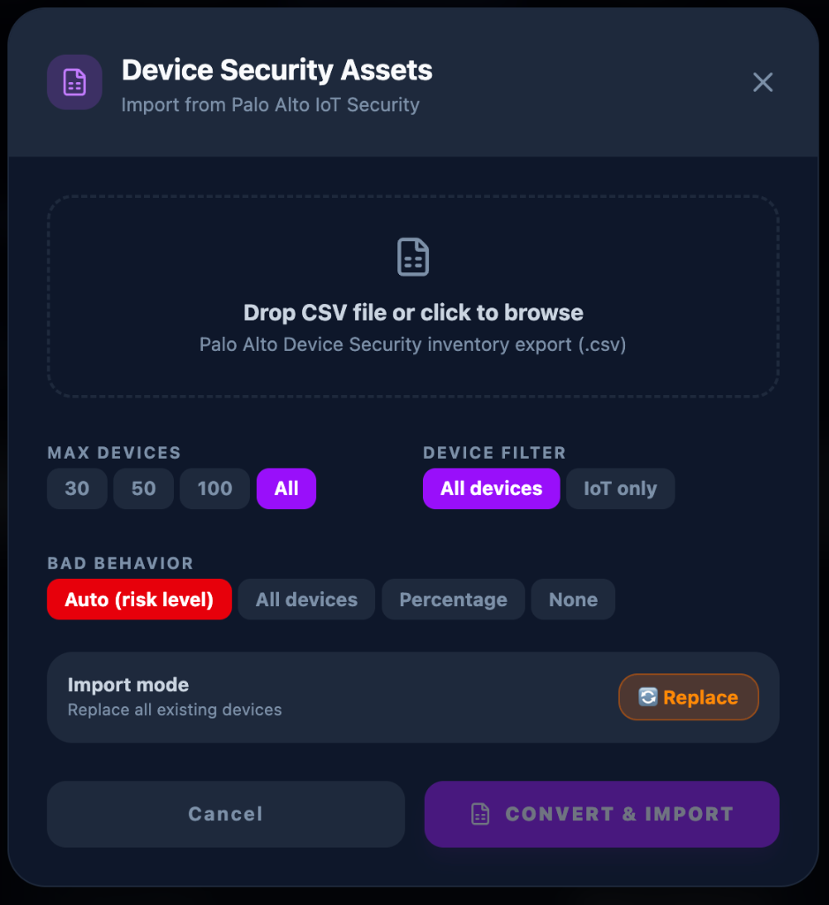
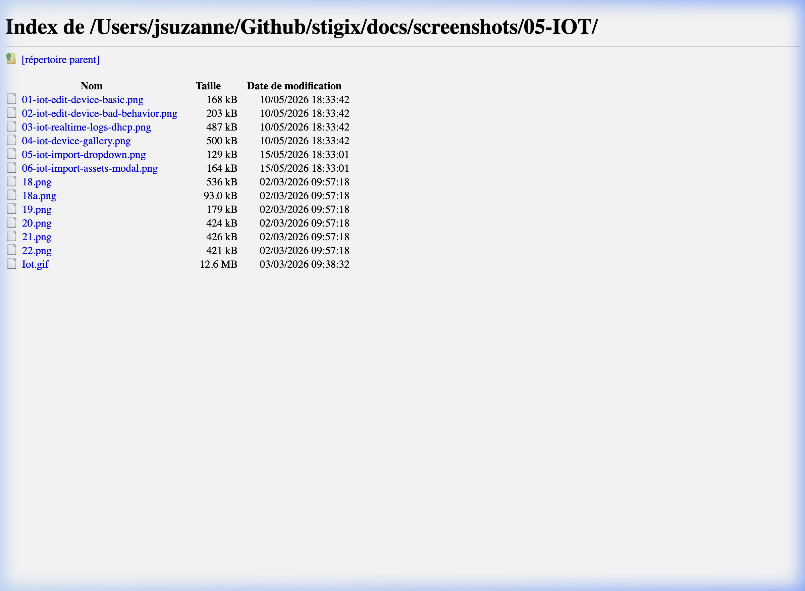
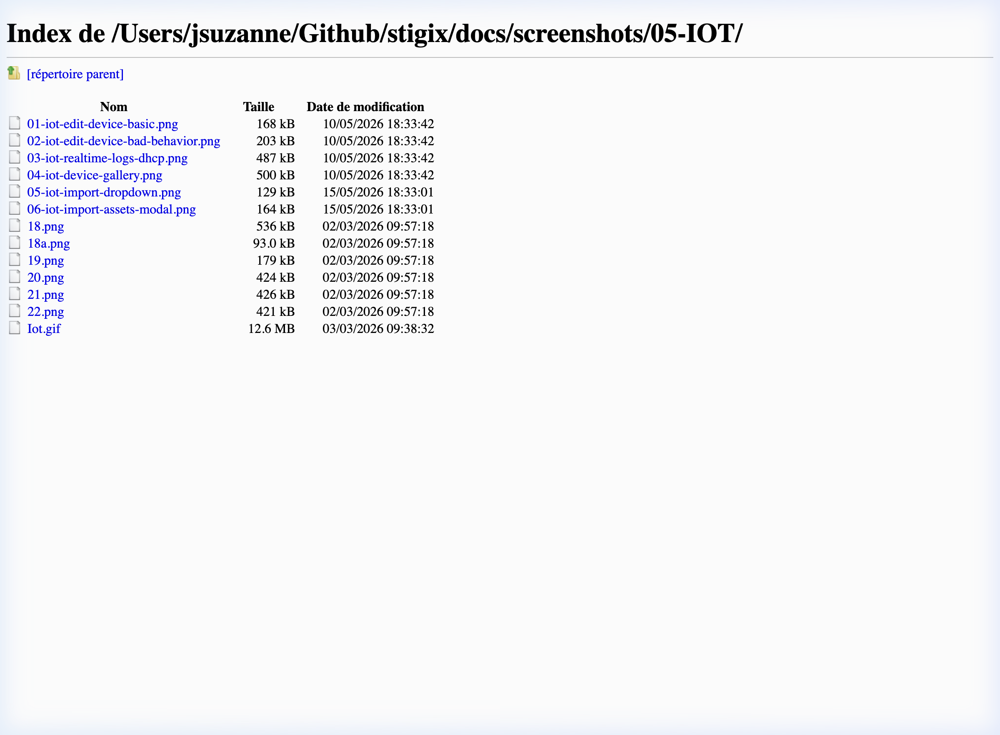

# 🤖 IoT Simulation & Device Management

The **SD-WAN Traffic Generator** includes a sophisticated IoT Simulation engine that allows network engineers to simulate a variety of IoT devices (cameras, sensors, smart plugs) on their network for testing security, segmentation, and failover.

## 🚀 Key Capabilities

### 📡 Layer-2/3 Simulation (Scapy)
Unlike standard traffic generators that use high-level HTTP libraries, our IoT engine uses **Scapy** to forge raw packets at the network layer.
- **DHCP Support**: Simulated devices can request and renew IP addresses from your real local DHCP server (Router/Core Switch).
- **DHCP Lease Persistence**: Each device's assigned IP is saved to disk. On container restart, the device uses [RFC 2131 INIT-REBOOT](https://www.rfc-editor.org/rfc/rfc2131#section-3.2) to reclaim the same IP — no DISCOVER needed if the server accepts.
- **ARP Handling**: Devices respond to ARP requests on the wire, making them appear "real" to networking equipment.
- **MAC Spoofing**: Each simulated device has its own unique, configurable MAC address.

## Platform Compatibility

### ✅ Full IoT Support (Host Mode - Linux Only)
IoT simulation with DHCP, ARP, and Layer 2 protocols requires **Host Mode networking**, which is only available on **native Linux installations**.

**Supported:**
- Ubuntu (bare metal or VM)
- Debian
- CentOS/RHEL
- Other native Linux distributions

**Requirements:**
- Native Linux (not WSL2)
- Docker installed
- Root/sudo access for network capabilities

### ⚠️ Limited IoT Support (Bridge Mode)
On macOS, Windows, and WSL2, IoT simulation runs in **Bridge Mode** with these limitations:

**Platforms:**
- macOS (Docker Desktop)
- Windows (Docker Desktop + WSL2)
- WSL2 (Windows Subsystem for Linux)

**Limitations:**
- ❌ No DHCP simulation
- ❌ No ARP spoofing
- ❌ No Layer 2 protocol simulation
- ✅ HTTP/HTTPS traffic simulation still works
- ✅ Voice/RTP simulation works (with reduced features)

**Why:** Docker's Host Mode networking is not supported on macOS and Windows. These platforms use a VM-based Docker engine that doesn't expose the host network stack directly.

## 🛠️ Use Cases

1. **SD-WAN Segmentation**: Verify that IoT traffic is correctly identified and placed into the "IoT VRF" or "Guest VLAN".
2. **Failover Testing**: See how IoT devices (which are often sensitive to jitter) behave when a circuit fails or a policy change occur.
3. **Security Validation**: Test your firewall rules against mock IoT traffic without having to purchase and wire up dozens of physical devices.

## 📝 Configuration

IoT devices are managed via the **IoT Tab** in the Dashboard. The configuration is stored in `config/iot-devices.json`.
Concurrency settings are stored separately in `config/iot-settings.json` (auto-created on first save).

*Device gallery displaying all simulated IoT hardware with their current network status:*


### Technical JSON Format

Each device in the JSON array follows this structure:

```json
{
  "id": "hikvis_security_cameras_01",
  "name": "Hikvision DS-2CD2042FWD",
  "vendor": "Hikvision",
  "type": "Security Camera",
  "mac": "00:12:34:56:78:01",
  "ip_start": "192.168.207.100",
  "protocols": ["dhcp", "arp", "lldp", "http", "rtsp", "cloud", "dns", "ntp"],
  "enabled": true,
  "traffic_interval": 180,
  "description": "Hikvision DS-2CD2042FWD - Security Camera",
  "fingerprint": {
    "dhcp": {
      "hostname": "DS-2CD2042FWD",
      "vendor_class_id": "HIKVISION",
      "client_id_type": 1,
      "param_req_list": [1, 3, 6, 12, 15, 28, 42, 51, 54, 58, 59]
    }
  }
}
```

**Key Fields:**
- `fingerprint.dhcp` - DHCP fingerprint for device identification by Palo Alto IoT Security
- `hostname` - DHCP Option 12
- `vendor_class_id` - DHCP Option 60
- `param_req_list` - DHCP Option 55 (Parameter Request List)

*Configuration modal for defining device identity, MAC address, and supported protocols:*


### 🤖 Device Configuration Generation

You have **three methods** to generate realistic IoT device configurations:

#### 1. Python Script Generator (Recommended for Speed)
Use the `generate_iot_devices.py` script for fast, deterministic device generation with built-in DHCP fingerprints.

**Features:**
- ✅ Instant generation (< 1 second)
- ✅ 13 device categories, 50+ vendors, 200+ models
- ✅ DHCP fingerprinting support
- ✅ Presets: Small (30), Medium (65), Large (110), Enterprise (170)
- ✅ Offline - no API calls required

**Quick Start:**
```bash
# Generate medium lab (65 devices)
python iot/generate_iot_devices.py --preset medium

# Custom configuration
python iot/generate_iot_devices.py --custom "Security Cameras:10,Sensors:20,Smart Lighting:15"
```

📖 **Full Documentation:** [IOT_DEVICE_GENERATOR.md](IOT_DEVICE_GENERATOR.md)

---

#### 2. LLM-Based Generation (Recommended for Custom Scenarios)
Use ChatGPT, Claude, or Gemini to generate industry-specific device configurations with contextual narratives.

**Features:**
- ✅ Industry-specific device mixes (Healthcare, Manufacturing, Utilities, etc.)
- ✅ Customer-tailored configurations
- ✅ Realistic vendor diversity
- ✅ DHCP fingerprints included

**Quick Start:**
Copy the prompt template from `iot/IOT_PROMPT.txt` and customize for your use case.

📖 **Full Documentation:** [IOT_LLM_GENERATION.md](IOT_LLM_GENERATION.md)

---

#### 3. Device Security Asset Import (Recommended for Real Environments)

If your customer already has **Palo Alto IoT Security** or **Prisma Access** deployed, you can export a real device inventory CSV and convert it directly into a Stigix emulator config. This produces the most accurate simulation because it is based on real devices observed on the customer's network.

**Features:**
- ✅ Uses real MAC addresses, hostnames, and vendor profiles from the customer network
- ✅ Extracts protocols from observed `Applications` telemetry (Prisma's real column name)
- ✅ **OS-aware DHCP fingerprinting** — overrides generic vendor defaults with actual OS signatures:
  - Windows → `MSFT 5.0` + Windows-specific Option 55
  - iOS → `dhcpcd-9.4.1` + iOS Option 55
  - Linux / Embedded → `udhcp` variants
  - Enea OSE (medical infusion pumps) → `Enea OSE`
  - FortiOS → `FortiGate`
  - macOS → `AAPLBSDPC/i386`
- ✅ **Asset Criticality** used as secondary bad-behavior signal (when `ml_risk_level` is missing)
- ✅ Automatically enables `bad_behavior` for `Critical` and `High` risk devices
- ✅ Sorts devices by risk level (Critical first) for `--max-devices` filtering
- ✅ Generates credible DHCP fingerprints per vendor (Hikvision, Axis, Apple, Rockwell…)
- ✅ Filters IoT-only devices (excludes PCs, VMs, tablets with `--only-iot`)
- ✅ Enriched `description` field: profile | OS | Risk level | Criticality | Wire/Wireless | VLAN

**Import via UI (Recommended):**

The dashboard provides a unified **Import** dropdown to restore configurations or ingest third-party assets.



1. Go to **IoT Simulation** -> click the **Import** button in the header toolbar.
2. Select **Device Security Assets** to import from a Palo Alto IoT Security CSV export.
3. In the modal, drag & drop your CSV file and configure your conversion options (max devices, risk level fallback, etc.).



4. Click **Convert & Import** to populate your simulation lab.

> The UI validates the CSV format client-side before sending to the server, rejecting non-compatible files immediately.

**Or via CLI:**
```bash
# Export device list from Prisma IoT Security dashboard as CSV, then:
python iot/import_prisma_devices.py -i "iot device bad sources.csv" -o devices.json

# IoT devices only, top 30 riskiest
python iot/import_prisma_devices.py -i "iot device bad sources.csv" -o devices.json --only-iot --max-devices 30

# Force bad behavior on 40% of devices
python iot/import_prisma_devices.py -i "iot device bad sources.csv" -o devices.json --security-percentage 40
```

📖 **Full Documentation:** [IOT_DEVICE_GENERATOR.md → Prisma CSV Import](IOT_DEVICE_GENERATOR.md#-prisma--iot-security-csv-import)

---

#### 4. Vulnerability Report Import *(New — CVE-based, richest threat intel)*

When your customer has a **Palo Alto IoT Security Vulnerability Report** (exported from IoT Security → Vulnerabilities), use `import_vuln_csv.py` to import it. Unlike the Inventory export (one row per device), this format has **one row per CVE per device** — so a device with 9 CVEs generates 9 rows.

**What makes it richer:**
- ✅ **CVE details**: CVSS score, Severity, ICS-CERT alerts, detection status per row
- ✅ **APT attribution**: `APT Names` field links CVEs to known threat actors (e.g. `FruityArmor`, `Fancy Bear`, `Cobalt Spider`)
- ✅ **Automatic aggregation**: rows are grouped by device (Device Name + IP + MAC)
- ✅ **Danger Score** ranking to select the most dangerous devices first
- ✅ **Threat-aware bad behavior**: APT groups → `beacon`, ICS-CERT → `port_scan`, Critical/High CVEs → `pan_test_domains`

**Danger Score formula:**

```
Danger Score = Risk Score (0–100)
             + Critical CVEs × 15
             + High CVEs    ×  8
             + Medium CVEs  ×  3
             + APT Groups   ×  5
             + ICS-CERT     × 10    (1 if present, else 0)
             + Max CVSS     ×  2    (integer part, e.g. 9.8 → 19)
```

#### 🔢 Reading a real Danger Score — example: Score 249

The device card below shows a **Raspberry Pi Device #3** with `SCORE 249`. Here is how that number is computed step by step from the raw CSV data:





| Signal | Raw value | Weight | Contribution |
|---|---|---|---|
| **Risk Score** (Prisma field, 0–100) | 30 | ×1 | **30** |
| **Critical CVEs** | 7 | ×15 | **105** |
| **High CVEs** | 8 | ×8 | **64** |
| **Medium CVEs** | 22 − 7 − 8 = 7 | ×3 | **21** |
| **APT Groups** | 0 (none attributed) | ×5 | **0** |
| **ICS-CERT** | ✅ present | ×10 | **10** |
| **Max CVSS** | 9.8 → int(9.8 × 2) | ×2 | **19** |
| | | **Total** | **249** |

> **Why these weights?** Each weight reflects the *operational severity* of the signal:
> - **Critical CVE × 15** — a single unauthenticated RCE is more dangerous than a high-scoring device with no known exploits.
> - **ICS-CERT × 10** — ICS alerts target industrial/OT protocols; a compromised ICS device can cause physical disruption.
> - **APT attribution × 5** — a CVE linked to a nation-state actor (e.g. Fancy Bear) signals active weaponization.
> - **CVSS × 2** — CVSS alone is a poor ranking criterion (many high-CVSS CVEs have no public exploit), so it contributes relatively little.

**What the card also tells you:**

| Badge | Meaning |
|---|---|
| `22 CVES` | Total unique CVEs across all rows aggregated for this device |
| `7 CRITICAL` | CVEs with Severity = Critical in the export |
| `8 HIGH` | CVEs with Severity = High |
| `CVSS 9.8` | Highest CVSS score among all CVEs for this device |
| `⚠ ICS-CERT` | At least one CVE carries an ICS-CERT advisory (OT/industrial risk) |
| `CVE-2023-38427 …` | Top 4 CVE IDs (sorted by CVSS desc), `+N` if more exist |
| `OS: Linux Raspberry Pi Os` | OS field from the CSV |
| `Site: Branch 5 - Florida` | Site Name field from the CSV |

**Attack behaviors assigned (Auto mode):**
- `ICS-CERT` present → `port_scan` (OT lateral movement simulation)
- Critical/High CVEs present → `pan_test_domains` (guaranteed PAN-OS detection)
- No APT groups → no `beacon` on this device

**Expected CSV format** (columns, one row per CVE):
```
Device Name, IP Address, MAC Address, Risk Score, Risk Level, Profile, Profile Vertical,
Vendor, Model, OS, Serial Number, Asset Tag, Site, Site Name,
CVE, ICS-Cert, CVSS, Severity, Status, ..., APT Names, ...
```

**Import via UI (Recommended):**

1. Go to **IoT Simulation** → click **Import** button → select **Vulnerability Report** (orange icon)
2. Drop your vulnerability CSV file — the UI validates columns client-side
3. Choose Max Devices (30 / 50 / 100 / All), Device Filter, Bad Behavior mode, Import mode
4. Click **Analyze & Import** — result shows device count, bad behavior count, and ICS-CERT device count

**Bad Behavior modes in the import modal:**

| Mode | Description |
|---|---|
| **Auto (CVE/APT)** | Default — behavior derived from threat intel: APT→beacon, ICS-CERT→port_scan, CVE→pan_test_domains |
| **All devices** | Force bad behavior on every imported device (regardless of CVE severity) |
| **Percentage** | Enable bad behavior on a random N% of devices |
| **None** | Import clean devices — no attack simulation |

**Or via CLI:**
```bash
# Export Vulnerability Report from PAN IoT Security → Vulnerabilities tab as CSV, then:
python iot/import_vuln_csv.py -i vulns.csv -o devices.json

# Top 30 most dangerous devices by Danger Score
python iot/import_vuln_csv.py -i vulns.csv -o devices.json --max-devices 30

# IoT devices only (filter by Profile Vertical)
python iot/import_vuln_csv.py -i vulns.csv -o devices.json --max-devices 50 --only-iot

# Force bad behavior on 80% of devices
python iot/import_vuln_csv.py -i vulns.csv -o devices.json --security-percentage 80

# Merge with existing device config (dedup by ID)
python iot/import_vuln_csv.py -i vulns.csv -o devices.json --merge
```

**Rich device description** (auto-generated, visible in device card):
```
OS: Linux Raspberry Pi Os | Risk: Low (30/100) | CVEs: 22 total — 7 critical / 8 high | Max CVSS: 9.8
Top CVEs: CVE-2023-38427 (CVSS 9.8 Critical), CVE-2023-38429 (CVSS 9.8 Critical), ...
ICS-CERT: YES | APT Groups: none
Site: Branch 5 - Florida | Danger Score: 249
```

---

**Then (CLI workflow only):**
1. Copy the generated JSON
2. Go to the **IoT Tab** in the dashboard
3. Click **Import Json**
4. Paste the JSON
5. Start simulating!

## ⚡ Concurrency Control (IoT Throttle)

### Why it matters

Each simulated IoT device runs via **Scapy raw sockets** inside a single Python daemon process. On Linux (host network mode), spawning too many concurrent Scapy sessions causes Python threads to enter **state D** (uninterruptible I/O wait), which starves the CPU scheduler and breaks latency-sensitive services:

| Lab config | CPU stigix | Python D-state | VoIP loss |
|---|---|---|---|
| 163 IoT devices active | ~100% | 5+ threads | 37–73% ❌ |
| 30 IoT devices active | ~18% | 0 | 0% ✅ |

### How the throttle works

Stigix uses a **semaphore queue** in the IoT manager. At any time, only `maxConcurrentDevices` devices are actually sending Scapy traffic. The rest wait their turn in a rotating queue.

**Device states:**

| State | Badge | Meaning |
|---|---|---|
| 🟢 **ACTIVE** | Green | Scapy process running, consuming a concurrency slot |
| 🟡 **QUEUED** | Amber | Waiting for a free slot — will activate automatically |
| 🔵 **IDLE** | Blue | Cycle complete, sleeping `traffic_interval` seconds before re-queuing |
| ⚫ **Stopped** | Gray | Manually removed from rotation by the user |

**Full state transition diagram:**

```
                ┌──────────────────────────────────────────────┐
                │          USER: Start button                  │
                ▼                                              │
 ──────────  slot libre ?                                      │
│ STOPPED  │──────┬────────────────┐                           │
 ──────────       │ OUI            │ NON                       │
                  ▼                ▼                           │
            ─────────        ─────────                         │
           │ ACTIVE  │      │ QUEUED  │◄──────────────┐         │
            ─────────        ─────────               │         │
               │  ▲               │                  │         │
  cycleTimer   │  │ promoteNext   │ slot se libère   │         │
  expire       │  └───────────────┘                  │         │
               │                                     │         │
               ▼                                     │         │
            ─────────   idleTimer expire              │         │
           │  IDLE   │   slot libre ? ───────────────┘         │
            ─────────   slot plein ? ──────────► QUEUED        │
               │                                               │
               │  USER: Shut (depuis IDLE ou ACTIVE)           │
               └───────────────────────────────────────────────┘
```

| De → Vers | Déclencheur |
|---|---|
| STOPPED → **ACTIVE** | `startDevice()`, slot disponible |
| STOPPED → **QUEUED** | `startDevice()`, slots pleins |
| QUEUED → **ACTIVE** | `promoteNextQueued()` — un slot se libère |
| ACTIVE → **IDLE** | `cycleTimer` expire (`traffic_interval` s) → stop daemon |
| IDLE → **ACTIVE** | `idleTimer` expire → slot disponible |
| IDLE → **QUEUED** | `idleTimer` expire → slots pleins |
| ACTIVE → **STOPPED** | User clique **Shut** |
| IDLE → **STOPPED** | User clique **Shut** |
| QUEUED → **STOPPED** | User clique **Dequeue** |
| QUEUED → **ACTIVE** | `setMaxConcurrent()` augmenté → promote immédiat |

**Rotation cycle:**

```
User starts 163 devices
        │
        ▼
  30 → ACTIVE  (traffic_interval seconds of Scapy traffic)
 133 → QUEUED  (waiting for a slot)
        │
        ▼  cycleTimer expires → stop sent to daemon
        │
      IDLE ──── idleTimer: traffic_interval seconds ──── re-queues
        │
        ▼
   Slot freed → next QUEUED becomes ACTIVE immediately
```

> This is actually **more realistic** than running all devices simultaneously. Real IoT devices don't send traffic continuously — they operate in cycles (DHCP renew, heartbeat, telemetry burst), then go quiet.

### Controlling concurrency from the UI

The **IoT Concurrency Control** panel appears at the top of the IoT tab:

- **Slider** — drag to set `maxConcurrentDevices` (range: 1 → total devices)
- **Default: 30** devices concurrent (configurable, persisted in `config/iot-settings.json`)
- Changes apply **immediately, live** — no restart required:
  - **Raise limit** → QUEUED devices promoted to ACTIVE instantly
  - **Lower limit** → ACTIVE devices finish their current cycle naturally (no `SIGKILL`)
- Live counters update every 5 seconds via Socket.IO `iot:health`:
  - 🟢 **Running** — number of ACTIVE Scapy sessions
  - 🟡 **In Queue** — QUEUED + IDLE devices (hidden when 0)
  - ⚫ **Stopped** — manually disabled devices

### Per-device card — timing indicators

Each device card shows **real-time timing info** below the state badge, updated every second client-side:

| Device state | Badge | Timing indicator | Action button |
|---|---|---|---|
| ACTIVE | 🟢 Running | Elapsed time since activation (e.g. `2m 14s`) | **Shut** (red) — removes from rotation |
| IDLE | 🔵 Idle | Countdown before re-queue (e.g. `45s left`) | **Shut** (red) — removes from rotation |
| QUEUED | 🟡 Queued | Position in queue (e.g. `#12`) | **Dequeue** (amber) — removes from rotation |
| STOPPED | ⚫ Stopped | — | **Start** (blue) — adds to queue or activates |

> Both **ACTIVE** and **IDLE** use the same red **Shut** button — from the user's perspective both states mean "the device is in the rotation". Clicking Shut removes it entirely. IDLE is just an internal sleep between traffic cycles.

### System Health mini-panel

The panel also displays real-time system metrics (updated every 5s via Socket.IO `iot:health`):

| Metric | Source | Warning threshold |
|---|---|---|
| **Host CPU %** | `/proc/stat` delta | > 80% → 🔴 HIGH |
| **UDP Errors/s** | `/proc/net/snmp` delta | > 20/s → warning |
| **Python D-state** | `ps -eo stat,comm` | ≥ 3 → 🔴 HIGH |

**VoIP Risk levels:**
- 🔴 **HIGH** — CPU > 80% or ≥ 3 D-state processes → reduce concurrency
- 🟡 **MEDIUM** — CPU > 60% or 1–2 D-state processes → monitor
- 🟢 **LOW** — Healthy, VoIP protected

> These metrics are read from inside the container. Because Stigix runs with `network_mode: host`, the container has direct access to the host's `/proc` filesystem, giving accurate system-level visibility.

### Bad Behavior in throttled mode

The throttle **does not limit attack capabilities** — it limits the number of concurrent Scapy sessions. Devices in ACTIVE state still execute their full bad behavior profile (DNS flood, C2 beacon, port scan, data exfil, etc.) at full intensity. Only 30 of them do it simultaneously instead of 163.

### Configuration file

```json
// config/iot-settings.json (auto-created)
{
  "maxConcurrentDevices": 30
}
```

This file is optional. If absent, the system defaults to 30. It is **upgrade-safe** — existing `iot-devices.json` files require no modification.

### API endpoints

| Endpoint | Method | Description |
|---|---|---|
| `/api/iot/settings` | GET | Returns `{ max, active, queued, idle }` |
| `/api/iot/settings` | POST | Body: `{ maxConcurrentDevices: number }` — applies live |
| `/api/iot/queue-status` | GET | Returns `{ states: { [id]: DeviceState }, timings: { [id]: TimingInfo } }` |
| `/api/iot/devices` | GET | Device list with `deviceState` and `timing` fields merged in |
| `/api/iot/bad-behavior` | GET | Returns `{ enabled: boolean }` — current global attack mode |
| `/api/system/iot-health` | GET | CPU%, UDP errors/s, D-state count, VoIP risk level |

**TimingInfo** object per device:
```json
// ACTIVE device
{ "activatedAt": 1747386000000 }           // Unix ms — client computes elapsed

// IDLE device
{ "idledAt": 1747386240000, "cycleSeconds": 240 }  // client computes countdown

// QUEUED device
{ "queuePosition": 12 }                    // 1-based position in the queue
```

---


---

### Protocol Support Details
- **`dhcp`**: Triggers a Scapy-based DHCP state machine (Discover → Offer → Request → Ack) with RFC 2131 INIT-REBOOT lease persistence (see below).
- **`arp`**: Listens for ARP Who-Has requests and responds with the spoofed MAC.
- **`cloud`**: Simulates periodic outbound "heartbeat" traffic to a vendor-specific FQDN.
- **`mqtt`**: Simulates periodic telemetry updates to an MQTT broker.

---

## ⏱️ Duty Cycle & `traffic_interval`

The **`traffic_interval`** field (shown as **Interval** on each device card) is the single parameter that controls the full duty cycle of a managed device.

### What it controls

| Phase | Duration | What happens |
|---|---|---|
| **ACTIVE** | `traffic_interval` seconds | Scapy runs, traffic is generated (min 30s enforced) |
| **IDLE** | `traffic_interval` seconds | Device sleeps, no packets sent |
| **Full cycle** | `2 × traffic_interval` | Before the device can run again |

**Example — Interval: 240s** (like the Philips UltraSound Machine):
```
ACTIVE  240s  → DHCP INIT-REBOOT, ARP, DNS, HTTP traffic
IDLE    240s  → silent (countdown visible: "3m left")
─────────────────────────────────────────────────────
Total   480s (~8 min) per cycle
```

### Expected queue wait time

With N devices and M slots:

```
Avg cycle = 2 × avg(traffic_interval) ≈ 2 × 180s = 360s
Slot rate  = M / 360s  (e.g. 30 / 360 = 1 slot per 12s)
Queue wait ≈ (N − M) × 12s  (e.g. 133 × 12s ≈ 26 min)
```

> In practice, devices get their turn roughly every `2 × traffic_interval × (N/M)` seconds. This is realistic — real IoT devices don't send traffic continuously; they operate in burst cycles then sleep.

### Setting `traffic_interval`

- **Via import scripts**: assigned randomly between 60–300s at import time (`random.randint(60, 300)`)
- **Via JSON**: edit the `traffic_interval` field directly
- **Via UI**: use the Edit modal on each device card

### DHCP on re-activation (wake from IDLE)

When a device goes IDLE → ACTIVE, it does **not** do a full DHCP Discover. It uses **RFC 2131 INIT-REBOOT** — a single broadcast REQUEST for the same IP it had before (stored in `dhcp_leases.json`). This is exactly how real IoT devices behave when waking from sleep:

```
IDLE → ACTIVE:
  DHCP REQUEST (requested_addr = last IP)  →  ACK  →  same IP confirmed (< 1s)
  (no DISCOVER, no OFFER — fast path)
```

The IP only changes if the DHCP server NAKs the INIT-REBOOT (subnet change, lease expired), in which case the device falls back to a full Discover automatically.

---

## 📋 DHCP Lease Persistence (RFC 2131 INIT-REBOOT)


By default, a DHCP server with no MAC reservations may assign a **different IP** to a device after a container restart. To solve this, the IoT emulator persists each device's assigned IP in a lease file that survives restarts.

### How it works

```
Boot device (MAC: aa:bb:cc:dd:ee:ff)
      │
      ▼
 config/dhcp_leases.json exists for this MAC?
      │
    YES ──► Last known IP: 192.168.1.42
      │           │
      │           ▼
      │    DHCP REQUEST broadcast (INIT-REBOOT, no DISCOVER)
      │    Option 50: requested_addr = 192.168.1.42
      │           │
      │         ACK ──► ✅ Same IP confirmed (~4s, fast path)
      │         NAK ──► 🔄 Subnet changed → full DISCOVER
      │     timeout ──► 🔄 No response   → full DISCOVER
      │
     NO ──► Full DISCOVER → OFFER → REQUEST → ACK (normal flow)
```

### Lease file location

Leases are stored in **`/app/config/dhcp_leases.json`**, which maps to the `./config/` directory of your Stigix installation — a persistent Docker volume.

```json
{
  "00:12:34:56:78:01": {
    "ip": "192.168.1.100",
    "gateway": "192.168.1.1",
    "timestamp": 1747386000.0
  },
  "ec:b5:fa:00:01:01": {
    "ip": "192.168.1.105",
    "gateway": "192.168.1.1",
    "timestamp": 1747386060.0
  }
}
```

> **Override:** Set the `DHCP_LEASE_FILE` environment variable to use a different path.

### Key behaviours

| Scenario | Result |
|---|---|
| Normal boot, saved lease, server ACKs | ✅ Same IP reclaimed instantly |
| Server NAKs (subnet changed, IP taken) | 🔄 Automatic fallback to full DISCOVER |
| Server doesn't respond to INIT-REBOOT | 🔄 Automatic fallback to full DISCOVER |
| Device never had an IP (first boot) | ➡️ Normal DISCOVER, no lease to restore |
| DHCP fails completely (no OFFER) | 🔕 Device stays silent, lease **not erased** (retry on next boot) |

---

## 🛡️ Security Testing (Bad Behavior)

The IoT engine includes a **Security Testing** mode designed to validate malicious behavior detection (e.g., Palo Alto Networks IoT Security).

When **Bad Behavior** is enabled, the simulated device will generate traffic patterns matching known attack profiles:
- **DNS Flood**: Rapid DNS queries to suspicious domains, repeated periodically.
- **C2 Beacon**: Periodic "heartbeat" connections to simulated Command & Control domains.
- **Port Scan**: Internal reconnaissance scanning local gateway and neighbors.
- **Data Exfil**: Simulated large data transfers (1400-byte TCP payloads) to external IPs.
- **PAN Test Domains**: Traffic to official Palo Alto test domains — **guaranteed detection by PAN-OS DNS Security and URL Filtering**.

*Security testing dashboard for triggering malicious traffic patterns and C2 beaconing:*


### `behavior_type` Reference

Each device's `security.behavior_type` is a list of attack pattern identifiers. Multiple values run as **parallel threads** simultaneously.

| `behavior_type` value | What it generates | Cycle | Burst | Scapy protocol |
|---|---|---|---|---|
| `"pan_test_domains"` | 2 DNS queries to PAN test domains + 1 URL HTTPS/HTTP SYN | Every **90s** | 2 DNS + 2 TCP | `IP/UDP/DNS`, `IP/TCP SYN` |
| `"beacon"` | 1 DNS + 1 TCP SYN to fake C2 domain | Every **45s** | 2 packets | `IP/UDP/DNS`, `IP/TCP SYN` |
| `"dns_flood"` | Burst of DNS queries to suspicious domains | Every **60s** | 3 queries | `IP/UDP/DNS` |
| `"port_scan"` | TCP SYN to 10 common ports on a random target | Every **120s** | 10 SYNs | `IP/TCP SYN` |
| `"data_exfil"` | 2 large TCP uploads (1400 bytes each) to external IPs | Every **90s** | 2 packets | `IP/TCP` with payload |
| `"random"` | Picks one of the above at random per cycle | Every **20–60s** | Varies | Mixed |

> **Load note (v1.4.0-patch.7):** Intervals were tuned to reduce Scapy raw socket pressure. This prevents Python D-state accumulation under concurrent device load while still generating detectable attack patterns.

### Bad Behavior Import Modes (UI)

When importing via **Device Security Assets** or **Vulnerability Report**, the modal offers four Bad Behavior modes:

| Mode | Device Security Assets | Vulnerability Report |
|---|---|---|
| **Auto** | Derived from `ml_risk_level` (Critical/High → bad behavior) | Derived from CVE severity + APT groups + ICS-CERT |
| **All devices** | Every device gets bad behavior | Every device gets bad behavior |
| **Percentage** | Random N% of devices | Random N% of devices |
| **None** | No bad behavior, clean simulation | No bad behavior, clean simulation |

**Auto mode (Vulnerability Report)** maps threat intel to specific behaviors:

| Signal | `behavior_type` assigned |
|---|---|
| APT groups present | `beacon` — realistic C2 heartbeat pattern |
| ICS-CERT alert | `port_scan` — OT lateral movement simulation |
| Critical or High CVEs | `pan_test_domains` — guaranteed PAN detection |
| No threat signal | `random` — mixed low-noise background |

### JSON Security Configuration

To enable bad behavior, include the `security` object in your device configuration.

#### 1. Palo Alto Networks Test Domains (Recommended for Validation)
Guaranteed to be detected by PAN-OS DNS Security and URL Filtering.
```json
"security": {
  "bad_behavior": true,
  "behavior_type": ["pan_test_domains"]
}
```

#### 2. C2 Beaconing
Simulates a classic malware heartbeat every 45 seconds.
```json
"security": {
  "bad_behavior": true,
  "behavior_type": ["beacon"]
}
```

#### 3. DNS Flood
Burst of 3 DNS queries to suspicious domains, repeated every 60s.
```json
"security": {
  "bad_behavior": true,
  "behavior_type": ["dns_flood"]
}
```

#### 4. Port Scan
Internal reconnaissance scanning local gateway and neighbors (10 ports, every 120s).
```json
"security": {
  "bad_behavior": true,
  "behavior_type": ["port_scan"]
}
```

#### 5. Data Exfiltration
Large TCP uploads (1400 bytes each) to known malicious external IPs, every 90s.
```json
"security": {
  "bad_behavior": true,
  "behavior_type": ["data_exfil"]
}
```

#### 6. Parallel Attack (Random Mix)
Launches multiple attack threads simultaneously for high complexity.
```json
"security": {
  "bad_behavior": true,
  "behavior_type": ["random", "dns_flood", "beacon"]
}
```

#### 7. Full Threat Profile (APT device)
Combines realistic C2 beaconing, OT lateral movement, and guaranteed PAN detection.
```json
"security": {
  "bad_behavior": true,
  "behavior_type": ["beacon", "port_scan", "pan_test_domains"]
}
```

## 📊 Visual Diagnostics & Logs

When a device starts, you can monitor the "Real-on-the-Wire" interaction in the UI logs via the **Real-time Analysis** modal:

*Real-time analysis logs showing low-level Scapy packet interaction and DHCP handshakes:*


When a device starts, you can monitor the "Real-on-the-Wire" interaction in the UI logs:

### DHCP — First boot (full sequence)
```text
🚀 Starting device simulation: Smart Bulb (bulb-01) [DHCP: auto]
🆔 MAC addr: ec:b5:fa:00:01:01
🔄 DHCP attempt 1 (mode: auto)...
📤 DHCP DISCOVER (xid: 0x1a2b3c4d, MAC: ec:b5:fa:00:01:01)
⏳ Waiting for DHCP OFFER (timeout: 4s)...
✅ DHCP OFFER from 192.168.1.1 (offered: 192.168.1.105)
📤 DHCP REQUEST for offered IP 192.168.1.105
⏳ Waiting for DHCP ACK (timeout: 4s)...
✅ DHCP ACK: 192.168.1.105 from 192.168.1.1
📣 Gratuitous ARP: 192.168.1.105 is-at ec:b5:fa:00:01:01
✅ DHCP complete (IP: 192.168.1.105, GW: 192.168.1.1)
```

### DHCP — Container restart (INIT-REBOOT fast path)
```text
🚀 Starting device simulation: Smart Bulb (bulb-01) [DHCP: auto]
🆔 MAC addr: ec:b5:fa:00:01:01
📋 Saved DHCP lease found: 192.168.1.105 — attempting INIT-REBOOT (RFC 2131)
📤 DHCP INIT-REBOOT REQUEST for 192.168.1.105 (xid: 0x5e6f7a8b)
✅ INIT-REBOOT success — same IP confirmed: 192.168.1.105
🌐 Gateway from DHCP: 192.168.1.1
📣 Gratuitous ARP: 192.168.1.105 is-at ec:b5:fa:00:01:01
```

### DHCP — INIT-REBOOT rejected (subnet changed)
```text
📋 Saved DHCP lease found: 10.0.0.50 — attempting INIT-REBOOT (RFC 2131)
📤 DHCP INIT-REBOOT REQUEST for 10.0.0.50 (xid: 0x3c4d5e6f)
⚠️ DHCP NAK for saved IP 10.0.0.50 (subnet changed?)
🔄 INIT-REBOOT rejected by server — falling back to full DISCOVER
🔄 DHCP attempt 1 (mode: auto)...
📤 DHCP DISCOVER ...
✅ DHCP complete (IP: 192.168.1.200, GW: 192.168.1.1)
```

### ARP Interaction
```text
🔍 [IOT] ARP Request from Router (192.168.1.1): Who has 192.168.1.105?
📤 [IOT] ARP Reply: 192.168.1.105 is at ec:b5:fa:00:01:01
```

## 📥 Import / Export
You can easily migrate your IoT lab setup between different generator instances using the **Import/Export** buttons. The system ensures data integrity and automatically creates backups of your configuration.

---

## 💾 State Persistence

Stigix preserves your IoT simulation state across container reboots and upgrades. This is controlled via **Settings → System Info → State Persistence**.

### How it works

| Action | Immediate effect | Persisted in JSON | Effect on next boot |
|---|---|---|---|
| **Start** a device | Enters ACTIVE or QUEUED | `enabled: true` | ✅ Device resumes (respects concurrency limit) |
| **Stop** a device | Removed from queue | `enabled: false` | ⛔ Device stays off |
| **Start-all** | Up to `maxConcurrent` → ACTIVE, rest → QUEUED | `enabled: true` for each | ✅ All resume with throttle |
| **Stop-all** | All processes stop, queue cleared | `enabled: false` for each | ⛔ All stay off |

> **Only devices that were running before the reboot will automatically restart.** If you started device A and left devices B and C stopped, after a reboot only device A will resume.

### Enable / Disable State Persistence

Go to **Settings → System Info → State Persistence** and toggle **IoT Simulation**:
- **ON** (default: OFF) — IoT devices restore their pre-reboot state 15 seconds after the container boots.
- **OFF** — No IoT devices start automatically; you start them manually from the IoT tab.

> The IoT toggle is only clickable if at least one device is configured. If your `iot-devices.json` is empty, the toggle remains grayed out with a configuration prompt.

---
*For more technical details on networking, see [SMART_NETWORKING.md](SMART_NETWORKING.md).*
