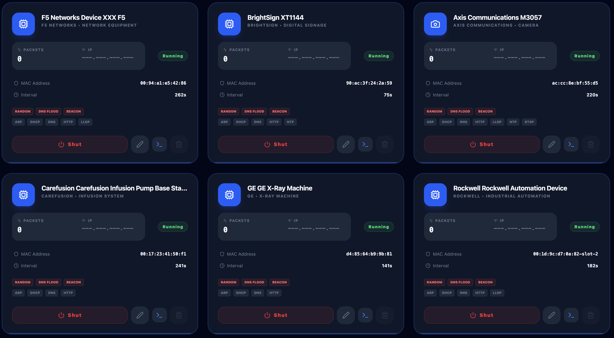
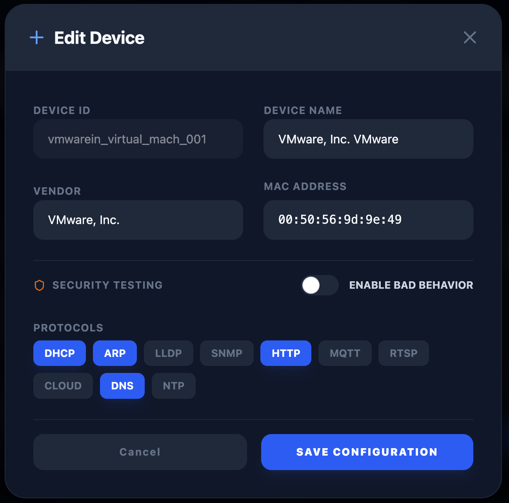
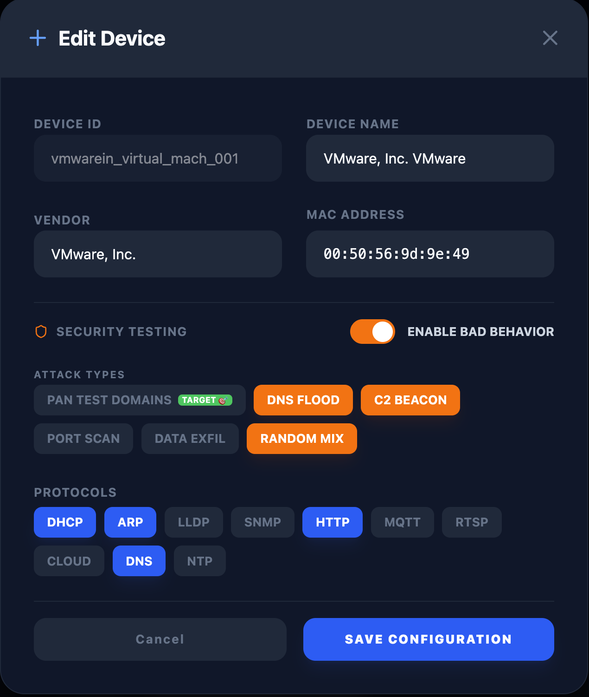
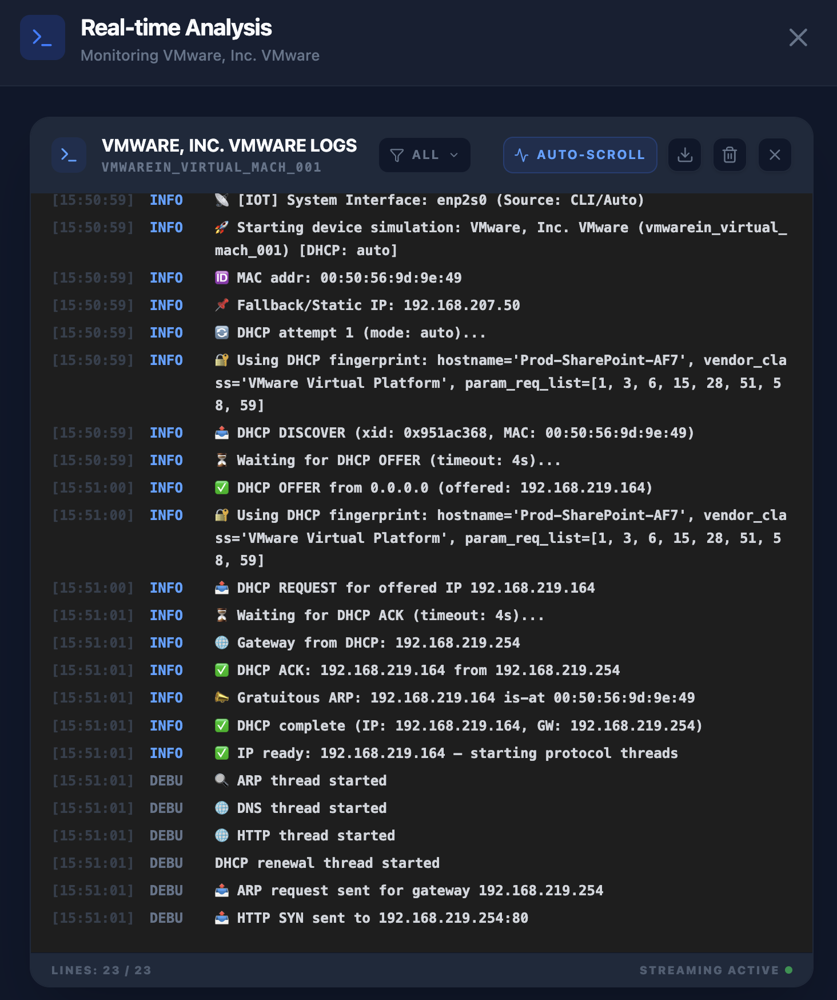

# 🤖 IoT Simulation & Device Management

The **SD-WAN Traffic Generator** includes a sophisticated IoT Simulation engine that allows network engineers to simulate a variety of IoT devices (cameras, sensors, smart plugs) on their network for testing security, segmentation, and failover.

## 🚀 Key Capabilities

### 📡 Layer-2/3 Simulation (Scapy)
Unlike standard traffic generators that use high-level HTTP libraries, our IoT engine uses **Scapy** to forge raw packets at the network layer.
- **DHCP Support**: Simulated devices can request and renew IP addresses from your real local DHCP server (Router/Core Switch).
- **ARP Handling**: Devices respond to ARP requests on the wire, making them appear "real" to networking equipment.
- **MAC Spoofing**: Each simulated device has its own unique, configurable MAC address.

## Platform Compatibility

### ✅ Full IoT Support (Host Mode - Linux Only)
IoT simulation with DHCP, ARP, and Layer 2 protocols requires **Host Mode networking**, which is only available on **native Linux installations**.

**Supported:**
- Ubuntu (bare metal or VM)
- Debian
- CentOS/RHEL
- Other native Linux distributions

**Requirements:**
- Native Linux (not WSL2)
- Docker installed
- Root/sudo access for network capabilities

### ⚠️ Limited IoT Support (Bridge Mode)
On macOS, Windows, and WSL2, IoT simulation runs in **Bridge Mode** with these limitations:

**Platforms:**
- macOS (Docker Desktop)
- Windows (Docker Desktop + WSL2)
- WSL2 (Windows Subsystem for Linux)

**Limitations:**
- ❌ No DHCP simulation
- ❌ No ARP spoofing
- ❌ No Layer 2 protocol simulation
- ✅ HTTP/HTTPS traffic simulation still works
- ✅ Voice/RTP simulation works (with reduced features)

**Why:** Docker's Host Mode networking is not supported on macOS and Windows. These platforms use a VM-based Docker engine that doesn't expose the host network stack directly.

## 🛠️ Use Cases

1. **SD-WAN Segmentation**: Verify that IoT traffic is correctly identified and placed into the "IoT VRF" or "Guest VLAN".
2. **Failover Testing**: See how IoT devices (which are often sensitive to jitter) behave when a circuit fails or a policy change occur.
3. **Security Validation**: Test your firewall rules against mock IoT traffic without having to purchase and wire up dozens of physical devices.

## 📝 Configuration

IoT devices are managed via the **IoT Tab** in the Dashboard. The configuration is stored in `config/iot-devices.json`.

*Device gallery displaying all simulated IoT hardware with their current network status:*



### Technical JSON Format

Each device in the JSON array follows this structure:

```json
{
  "id": "hikvis_security_cameras_01",
  "name": "Hikvision DS-2CD2042FWD",
  "vendor": "Hikvision",
  "type": "Security Camera",
  "mac": "00:12:34:56:78:01",
  "ip_start": "192.168.207.100",
  "protocols": ["dhcp", "arp", "lldp", "http", "rtsp", "cloud", "dns", "ntp"],
  "enabled": true,
  "traffic_interval": 180,
  "description": "Hikvision DS-2CD2042FWD - Security Camera",
  "fingerprint": {
    "dhcp": {
      "hostname": "DS-2CD2042FWD",
      "vendor_class_id": "HIKVISION",
      "client_id_type": 1,
      "param_req_list": [1, 3, 6, 12, 15, 28, 42, 51, 54, 58, 59]
    }
  }
}
```

**Key Fields:**
- `fingerprint.dhcp` - DHCP fingerprint for device identification by Palo Alto IoT Security
- `hostname` - DHCP Option 12
- `vendor_class_id` - DHCP Option 60
- `param_req_list` - DHCP Option 55 (Parameter Request List)

*Configuration modal for defining device identity, MAC address, and supported protocols:*



### 🤖 Device Configuration Generation

You have **three methods** to generate realistic IoT device configurations:

#### 1. Python Script Generator (Recommended for Speed)
Use the `generate_iot_devices.py` script for fast, deterministic device generation with built-in DHCP fingerprints.

**Features:**
- ✅ Instant generation (< 1 second)
- ✅ 13 device categories, 50+ vendors, 200+ models
- ✅ DHCP fingerprinting support
- ✅ Presets: Small (30), Medium (65), Large (110), Enterprise (170)
- ✅ Offline - no API calls required

**Quick Start:**
```bash
# Generate medium lab (65 devices)
python iot/generate_iot_devices.py --preset medium

# Custom configuration
python iot/generate_iot_devices.py --custom "Security Cameras:10,Sensors:20,Smart Lighting:15"
```

📖 **Full Documentation:** [IOT_DEVICE_GENERATOR.md](IOT_DEVICE_GENERATOR.md)

---

#### 2. LLM-Based Generation (Recommended for Custom Scenarios)
Use ChatGPT, Claude, or Gemini to generate industry-specific device configurations with contextual narratives.

**Features:**
- ✅ Industry-specific device mixes (Healthcare, Manufacturing, Utilities, etc.)
- ✅ Customer-tailored configurations
- ✅ Realistic vendor diversity
- ✅ DHCP fingerprints included

**Quick Start:**
Copy the prompt template from `iot/IOT_PROMPT.txt` and customize for your use case.

📖 **Full Documentation:** [IOT_LLM_GENERATION.md](IOT_LLM_GENERATION.md)

---

#### 3. Prisma / IoT Security CSV Import (Recommended for Real Environments)

If your customer already has **Palo Alto IoT Security** or **Prisma Access** deployed, you can export a real device inventory CSV and convert it directly into a Stigix emulator config. This produces the most accurate simulation because it is based on real devices observed on the customer's network.

**Features:**
- ✅ Uses real MAC addresses, hostnames, and vendor profiles from the customer network
- ✅ Extracts protocols from observed `display_apps` telemetry
- ✅ Automatically enables `bad_behavior` for `Critical` and `High` risk devices
- ✅ Sorts devices by risk level (Critical first) for `--max-devices` filtering
- ✅ Generates credible DHCP fingerprints per vendor (Hikvision, Axis, Apple, Rockwell…)
- ✅ Filters IoT-only devices (excludes PCs, VMs, tablets with `--only-iot`)

**Quick Start:**
```bash
# Export device list from Prisma IoT Security dashboard as CSV, then:
python iot/import_prisma_devices.py -i "iot device bad sources.csv" -o devices.json

# IoT devices only, top 30 riskiest
python iot/import_prisma_devices.py -i "iot device bad sources.csv" -o devices.json --only-iot --max-devices 30
```

📖 **Full Documentation:** [IOT_DEVICE_GENERATOR.md → Prisma CSV Import](IOT_DEVICE_GENERATOR.md#-prisma--iot-security-csv-import)

---

**Then:**
1. Copy the generated JSON
2. Go to the **IoT Tab** in the dashboard
3. Click **Import**
4. Paste the JSON
5. Start simulating!


### Protocol Support Details
- **`dhcp`**: Triggers a Scapy-based DHCP state machine (Discover -> Offer -> Request -> Ack).
- **`arp`**: Listens for ARP Who-Has requests and responds with the spoofed MAC.
- **`cloud`**: Simulates periodic outbound "heartbeat" traffic to a vendor-specific FQDN.
- **`mqtt`**: Simulates periodic telemetry updates to an MQTT broker.

## 🛡️ Security Testing (Bad Behavior)

The IoT engine includes a **Security Testing** mode designed to validate malicious behavior detection (e.g., Palo Alto Networks IoT Security). 

When **Bad Behavior** is enabled, the simulated device will generate traffic patterns matching known attack profiles:
- **DNS Flood**: Rapid DNS queries to various domains.
- **C2 Beacon**: Periodic "heartbeat" connections to simulated Command & Control domains.
- **Port Scan**: Internal scanning of the local subnet.
- **Data Exfil**: Simulated large data transfers to external IPs.
- **PAN Test Domains**: Generates traffic to official Palo Alto test domains for guaranteed detection.

*Security testing dashboard for triggering malicious traffic patterns and C2 beaconing:*



### JSON Security Configuration

To enable bad behavior, include the `security` object in your device configuration.

#### 1. Palo Alto Networks Test Domains (Recommended for Validation)
Guaranteed to be detected by PAN-OS DNS Security and URL Filtering.
```json
"security": {
  "bad_behavior": true,
  "behavior_type": ["pan_test_domains"]
}
```

#### 2. C2 Beaconing
Simulates a classic malware heartbeat every 10 seconds.
```json
"security": {
  "bad_behavior": true,
  "behavior_type": ["beacon"]
}
```

#### 3. DNS Flood
Rapid burst of DNS queries for malicious domains.
```json
"security": {
  "bad_behavior": true,
  "behavior_type": ["dns_flood"]
}
```

#### 4. Port Scan
Internal reconnaissance scanning local gateway and neighbors.
```json
"security": {
  "bad_behavior": true,
  "behavior_type": ["port_scan"]
}
```

#### 5. Data Exfiltration
Large TCP uploads to known malicious external IPs.
```json
"security": {
  "bad_behavior": true,
  "behavior_type": ["data_exfil"]
}
```

#### 6. Parallel Attack (Random Mix)
Launches multiple attack threads simultaneously for high complexity.
```json
"security": {
  "bad_behavior": true,
  "behavior_type": ["random", "dns_flood", "beacon"]
}
```

## 📊 Visual Diagnostics & Logs

When a device starts, you can monitor the "Real-on-the-Wire" interaction in the UI logs via the **Real-time Analysis** modal:

*Real-time analysis logs showing low-level Scapy packet interaction and DHCP handshakes:*



When a device starts, you can monitor the "Real-on-the-Wire" interaction in the UI logs:

### DHCP Sequence (Success)
```text
🔄 [IOT] Starting DHCP sequence for 'Smart Bulb' (ec:b5:fa:00:01:01)...
📤 [DHCP] Sending DISCOVER on enp2s0
✅ [DHCP] Received OFFER from 192.168.1.1 (Offered IP: 192.168.1.105)
✅ [DHCP] ACK received. Device 'Smart Bulb' is now LIVE on 192.168.1.105
```

### ARP Interaction
```text
🔍 [IOT] ARP Request from Router (192.168.1.1): Who has 192.168.1.105?
📤 [IOT] ARP Reply: 192.168.1.105 is at ec:b5:fa:00:01:01
```

## 📥 Import / Export
You can easily migrate your IoT lab setup between different generator instances using the **Import/Export** buttons. The system ensures data integrity and automatically creates backups of your configuration.

---
*For more technical details on networking, see [SMART_NETWORKING.md](SMART_NETWORKING.md).*
