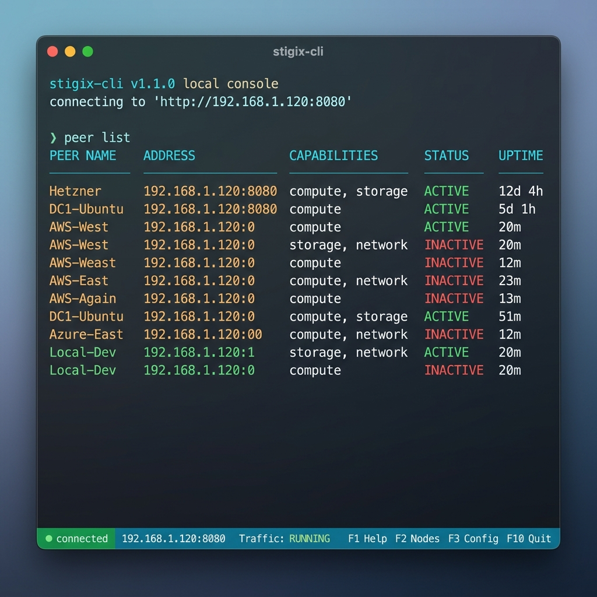

# Stigix CLI Reference Guide

`stigix-cli` is an interactive console and automation tool for managing Stigix instances. It connects directly to the Stigix backend API, allowing you to trigger tests, view real-time traffic statistics, run security audits, control simulated IoT devices, and monitor router failover convergence.

> [!NOTE]
> The Stigix CLI is currently in **Beta**. Some features and command structures may evolve in future releases.

---

## 🚀 Getting Started

Depending on how you have deployed Stigix, there are two ways to run the CLI.

### Option A: Via Docker (Recommended for Container Deployments)
If Stigix is installed via container, the CLI and all dependencies are pre-installed inside the container. You can run it directly from the host machine with:

```bash
# Start the interactive console
docker exec -it stigix stigix-cli

# Run a single command headless and exit
docker exec -it stigix stigix-cli --exec "status"
```

### Option B: From the Host Machine (Local Development)
To run the CLI directly from your local host machine, ensure python dependencies are installed first:

```bash
# 1. Install dependencies (requests and prompt_toolkit)
pip install requests prompt_toolkit

# 2. Run the interactive console
python Scripts/stigix-cli.py
```
*(Or use `.venv/bin/python Scripts/stigix-cli.py` if using the repository's virtual environment)*

---

## ⌨️ Interactive UI & Shortcuts

When running the interactive console, the CLI features auto-completion, command history, and a status toolbar at the bottom.



| Shortcut | Action |
|---|---|
| **`F1`** | Instantly displays the main help screen |
| **`F5`** | Forces a status update / refresh of the bottom toolbar |
| **`Ctrl + L`** | Clears the terminal screen |
| **`Ctrl + C`** / `exit` / `quit` | Clars current input / Exits the shell |

---

## ⚙️ Automation & Headless Options

You can automate tasks by passing arguments directly to the docker execution command:

*   **Override Backend URL**: Connect to a remote Stigix instance.
    ```bash
    docker exec -it stigix stigix-cli --url http://192.168.1.100:8080
    ```
*   **Execute & Exit**: Run a command without opening the interactive prompt.
    ```bash
    docker exec -it stigix stigix-cli --exec "security suite"
    ```
*   **Run Script File**: Execute a text file containing commands (one command per line).
    ```bash
    docker exec -it stigix stigix-cli --script test-plan.txt
    ```

## 🔗 Connecting & Logging into a Remote Instance

If you are running the CLI from your local machine and want to manage a remote Stigix target host (e.g. `192.168.1.120`), follow these steps:

### Step 1: Connect to the Remote Host
Launch the CLI and instruct it to target the remote instance's backend URL:
```bash
docker exec -it stigix stigix-cli --url http://192.168.1.120:8080
```
*(Alternatively, if you are already inside the interactive CLI prompt, you can type `connect 192.168.1.120:8080`)*

### Step 2: Authenticate (Log In)
Upon connecting to a new remote instance, you will see a warning: `⚠ No token for this instance — run: auth login`.

To log in, type:
```text
auth login
```
The console will prompt you for credentials:
```text
Username [admin]: admin
Password: <type password>
```
Upon success, the session token is saved automatically to your profile config. The CLI prompt will update, and you can now run any command against the remote Stigix host.

---

## 📚 Command Reference

### 1. Connection & Session (`connect`, `auth`)
The CLI automatically saves your active connection URL and authenticated JWT token in `~/.stigix-cli.json` for future sessions.

*   `status` — Show overall Stigix instance status (backend readiness, version, traffic engine state, and public IP).
*   `auth login` — Authenticate with Stigix using username and password.
*   `auth status` — Check current session authentication status.
*   `auth logout` — Log out and clear saved JWT token.
*   `connect` — View current URL status and saved connection profiles.
*   `connect <ip>` — Switch the active connection to another Stigix IP.
*   `connect save <profile-name> [url]` — Save a named connection profile.
*   `connect list` — List all saved profiles.
*   `connect forget <profile-name>` — Remove a saved profile.
*   `autocomplete <on|off|status>` — Enable, disable, or query tab autocompletion status (saves state in configuration).

---

### 2. Traffic Generator (`traffic`)
*   `traffic start` — Start generating background traffic.
*   `traffic stop` — Stop generating traffic.
*   `traffic status` — Check if traffic generator is running or stopped (displays current speed delay and density clients).
*   `traffic speed [val]` — Get or set delay in seconds (0.01 - 60.0s) or preset (`turbo`, `fast`, `normal`, `slow`) to change request rate.
*   `traffic density [val]` — Get or set number of parallel client generators (1 - 20) to change traffic volume.
*   `traffic stats` — View real-time counters and traffic metrics.
*   `traffic logs` — Print the latest log entries from the traffic generator.
*   `traffic reset` — Reset statistics counters to zero.
*   `traffic export [file]` — Export applications traffic configuration to a local JSON file (defaults to `stigix-traffic-export.json`).
*   `traffic import <file>` — Overwrite the applications traffic configuration from a local JSON file.

---

### 3. Security Audits (`security`)
Simulates traffic corresponding to security capabilities of Palo Alto Networks SASE (Prisma Access) to test blocking behavior.

*   `security status` — Show aggregate metrics of blocked/allowed queries.
*   `security suite` — **Run a complete automated security audit** (URL batch, DNS batch, and Threat prevention).
*   `security url <url>` — Perform a single URL Filtering test.
*   `security url-batch` — Test all URL categories enabled in the current configuration.
*   `security dns <domain>` — Perform a single DNS security test.
*   `security dns-batch` — Test all DNS domains enabled in the config.
*   `security eicar [endpoint]` — Perform an EICAR Threat Prevention test against a specific target.
*   `security results [n]` — View the last *N* security logs (default: 20).
*   `security clear` — Clear all security test results from the history database.
*   `security select-all <url|dns> <on|off>` — Enable or disable all URL filtering categories or DNS security tests at once.
*   `security schedule <url|dns|threat> <on|off> [minutes]` — Configure periodic security testing timers (intervals can be 5, 10, 15, 30, 45, or 60 minutes).

---

### 4. Convergence & Failover (`convergence`)
Used to measure packet loss and network recovery time during link/routing failovers.

*   `convergence status` — Show if a blackout test is currently running.
*   `convergence start --target <ip> --pps <pps> --label <label>` — Start sending probe packets to measure failover.
*   `convergence stop` — Stop the active blackout test.
*   `convergence history [n]` — View past failover test results and blackout times.
*   `convergence endpoints` — List configured probe targets.
*   `convergence watch [interval]` — Watch real-time probe loss and latency metrics.
*(Note: the `failover` command is supported as a backward-compatible alias for `convergence`)*

---

### 5. Router Actions (`vyos`)
Control and trigger sequence configurations on VyOS routers.

*   `vyos list` — List all connected VyOS routers.
*   `vyos sequences` — List available automation sequences.
*   `vyos run <sequence-id>` — Trigger a sequence (e.g., block/unblock WAN links).
*   `vyos stop <sequence-id>` — Terminate a running sequence.
*   `vyos history [n]` — Show past command sequence execution history.
*   `vyos export [file]` — Export current router and sequence configuration to a local JSON file (defaults to `vyos-config.json`).
*   `vyos import <file>` — Overwrite the current VyOS configuration from a local JSON file.

---

### 6. IoT Simulation (`iot`)
Manage simulated IoT devices and view vulnerability findings.

*   `iot list` — List all simulated IoT devices and their states.
*   `iot start [device-id]` — Start simulation for one or all IoT devices.
*   `iot stop [device-id]` — Stop simulation for one or all IoT devices.
*   `iot stats` — Show total sent packages and simulation bandwidth.
*   `iot vulns [n]` — View vulnerability scan logs (CVE findings, severity, and device mappings).
*   `iot export [file]` — Export simulated IoT device profiles into standard JSON configurations (defaults to `iot-devices.json`).
*   `iot import <file> [flags]` — Import device setups from a file. Auto-detects Stigix JSON configurations, Prisma IoT Assets Inventory CSV, and Palo Alto CVE Report CSV, supporting flags like `--merge`, `--max-devices <N>`, `--only-iot`, and `--enable-security`.

---

### 7. VoIP Testing (`voice`)
Measure VoIP link quality using Mean Opinion Score (MOS) against configured targets.

Stigix simulates voice traffic in the background using a multi-stream daemon. Calling `voice start` toggles the global Voice Simulation daemon on, initiating periodic simulated RTP call streams to configured peer targets.

*   `voice start` — Start VoIP simulation.
    *   **Interactive Mode**: If run without any arguments in interactive console mode, it fetches the list of available voice targets from the registry and prompts you to choose which targets to simulate:
        ```text
        Available Voice Targets:
          0: [All Targets] (Simulate all concurrently)
          1: Branch-1 (192.168.1.120)
          2: Branch-2 (192.168.1.130)

        Select target [0]: 
        ```
    *   **Non-Interactive / Headless Mode**: If run headlessly, it default-configures all available targets in the registry with voice capability and starts the daemon.
*   `voice start --target <IP_or_Name>` — Syncs and starts VoIP simulation *only* to the specified target.
*   `voice start --target all` — Syncs and starts VoIP simulation to *all* available voice-capable targets.
*   `voice stop` — Stop the global VoIP simulation daemon.
*   `voice status` — Show if the VoIP simulation daemon is currently active and how many concurrent calls are allowed.
*   `voice stats` — View MOS score, Jitter, Packet Loss, and RTT statistics from recent calls.

---

### 8. Target Probes (`probes`)
Configure and run active latency, availability, and score probes.

*   `probes list` — List targets configured for connectivity/DEM probes.
*   `probes stats` — Show global scores, latency averages, and packet reliability statistics.
*   `probes add --name <name> --host <ip/domain> --type <http/https/ping/dns>` — Add a new probe target.
*   `probes remove <id>` — Remove a probe target.
*   `probes probe` — Force execute a connectivity probe against all targets.
*   `probes export [file]` — Export custom probes configuration to JSON.
*   `probes import <file>` — Import custom probes configuration from JSON.
*(Note: the `experience` and `probe` commands are supported as backward-compatible aliases for `probes`)*

---

### 9. Stigix Targets (`target`)
Manually manage Stigix target nodes (which host echo responders, VoIP targets, and speedtest servers).

*   `target list` — List all configured Stigix targets, their capabilities, and online status.
*   `target add` — Add a new target manually using **Interactive Mode**. If you run `target add` without any flags, the console will prompt you for the target parameters step-by-step:
    ```text
    Name (e.g. Branch-1): Branch-1
    Host (IP or FQDN): 192.168.1.120
    ```
    *By default, interactive mode will enable all capabilities (`voice`, `convergence`, `xfr`, `security`, `connectivity`) on the new target.*
*   `target add --name <name> --host <ip/domain>` — Add a new target using explicit flags. Optional flags can be used to disable specific capabilities: `--voice {true|false}`, `--convergence {true|false}`, `--xfr {true|false}`, `--security {true|false}`, `--connectivity {true|false}`.
*   `target remove <name/id/host>` — Delete a target by name, host IP, or truncated 12-character ID. In interactive mode, it will prompt for confirmation (`Are you sure...`).
*   target enable <name/id/host> / target disable <name/id/host> — Enable or disable a target by name, host IP, or truncated 12-character ID.
*   `target export [file]` — Export targets to JSON.
*   `target import <file>` — Import targets from JSON.
*(Note: the `peer` command is supported as a backward-compatible alias for `target`)*

---

### 10. Bandwidth Speedtests (`speedtest`)
Run iPerf3/XFR speedtests to evaluate path bandwidth, latency, and packet loss.

*   `speedtest list` or `speedtest history` — View the history of speedtest jobs and their results.
*   `speedtest run <host>` — Launch a default speedtest to a target peer host.
*   `speedtest run <host> [options]` — Launch a custom speedtest to a target host.
    *   **Options**: `--port <9000>`, `--protocol {tcp|udp|quic}`, `--direction {client-to-server|server-to-client|bidirectional}`, `--duration <sec>`, `--bitrate <rate>`, `--streams <num>`, `--psk <pwd>`.
    *   This command streams real-time performance updates (Tx/Rx throughput, RTT, and loss) directly in the console.

---

### 11. System Administration (`system`)
*   `system info` — Show backend CPU, memory, disk utilization, and uptime.
*   `system interfaces` — List network interfaces on the Stigix host.
*   `system logs` — Print the last 30 lines of general backend logs.
*   `system restart` — Restart the Stigix containers.
*   `system upgrade` — Pull the latest Docker images and upgrade Stigix.

---

## 📊 Command Output Examples

Here are some examples of CLI commands run via Docker against a live Stigix instance:

### 1. Check Global Instance Status
```bash
docker exec -it stigix stigix-cli --exec "status"
```
**Output:**
```text
┏━━━━━━━━━━━━━━━━━━━━━━━━━━━━━━━━━━━━━━━━━━━━━━━━━━━━━━━━━━━━━━┓
┃                    Stigix Status Overview                    ┃
┣━━━━━━━━━━━━━━━━━━━━━━━━━━━━━━━━━━━━━━━━━━━━━━━━━━━━━━━━━━━━━━┫
┃  Backend     : [READY]  uptime: 1h 24m 5s                    ┃
┃  Version     : v1.4.0-patch.88                               ┃
┃  Traffic Gen : [RUNNING]                                     ┃
┃  Prisma Site : BR8                                           ┃
┣──────────────────────────────────────────────────────────────┫
┃  Local IP    : 192.168.219.1 (enp2s0)                        ┃
┃  Gateway     : 192.168.219.254                               ┃
┃  Traffic If  : enp2s0                                        ┃
┃  Public IP   : 2.13.195.58                                   ┃
┗━━━━━━━━━━━━━━━━━━━━━━━━━━━━━━━━━━━━━━━━━━━━━━━━━━━━━━━━━━━━━━┛
```

### 2. List Connectivity/DEM Probes
```bash
docker exec -it stigix stigix-cli --exec "probes list"
```
**Output:**
```text
  ID  Name                  Host/URL  Type   On
  ──  ────────────────────  ────────  ─────  ──
  ?   Cloudflare ICMP       ?         PING   ✓ 
  ?   Google ICMP           ?         PING   ✓ 
  ?   Google DNS Res        ?         DNS    ✓ 
  ?   Google Search         ?         HTTP   ✓ 
  ?   Hetzner ICMP          ?         PING   ✓ 
  ?   Hetzner Slow          ?         HTTP   ✓ 
  ?   Info / Egress         ?         CLOUD  ✓ 
  ?   Slow SaaS             ?         CLOUD  ✓ 
  ...
```

### 3. List Configured Stigix Peer Nodes
```bash
docker exec -it stigix stigix-cli --exec "target list"
```
**Output:**
```text
  ID            Name        Host             Capabilities                                     On  Source     
  ────────────  ──────────  ───────────────  ───────────────────────────────────────────────  ──  ───────────
  30dbb12a-c6e  Hetzner     142.132.193.157  voice, convergence, xfr, security, connectivity  ✓   managed    
  syn-security  DC1-Ubuntu  192.168.203.100  voice, convergence, xfr, security, connectivity  ✓   synthesized
  reg-DC7-Ubun  DC7-Ubuntu  192.168.205.10   voice, convergence, xfr, security, connectivity  ✓   synthesized
  reg-BR8-Ubun  BR8-Ubuntu  192.168.219.1    voice, convergence, xfr, security, connectivity  ✓   synthesized
```

### 4. Run an Interactive Speedtest with Real-time Streaming
```bash
docker exec -it stigix stigix-cli --exec "speedtest run 142.132.193.157 --duration 10"
```
**Output:**
```text
→ Starting speedtest to 142.132.193.157:9000 (TCP / client-to-server)...
✓ Speedtest job XFR-0022 accepted.
→ Streaming real-time performance metrics (Ctrl+C to stop)...
  Tx: 0.0 Mbps   Rx: 0.0 Mbps   RTT: 0.0ms   Loss: 0.0%
  Tx: 0.7 Mbps   Rx: 0.0 Mbps   RTT: 230.5ms   Loss: 0.0%
  Tx: 1.3 Mbps   Rx: 0.0 Mbps   RTT: 234.7ms   Loss: 0.0%
  Tx: 1.7 Mbps   Rx: 0.0 Mbps   RTT: 231.5ms   Loss: 0.0%
  Tx: 1.6 Mbps   Rx: 0.0 Mbps   RTT: 235.4ms   Loss: 0.0%
  Tx: 1.1 Mbps   Rx: 0.0 Mbps   RTT: 230.9ms   Loss: 0.0%
  Tx: 1.3 Mbps   Rx: 0.0 Mbps   RTT: 229.5ms   Loss: 0.0%
  Tx: 0.9 Mbps   Rx: 0.0 Mbps   RTT: 234.1ms   Loss: 0.0%
  Tx: 1.2 Mbps   Rx: 0.0 Mbps   RTT: 233.0ms   Loss: 0.0%
  Tx: 1.0 Mbps   Rx: 0.0 Mbps   RTT: 235.4ms   Loss: 0.0%

✓ Speedtest COMPLETED successfully!
```
