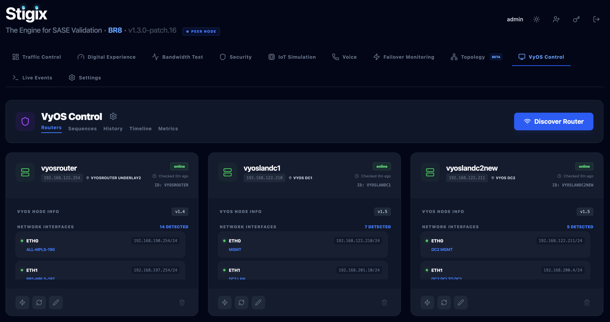
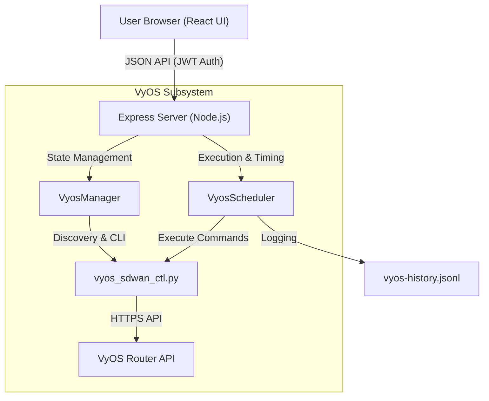
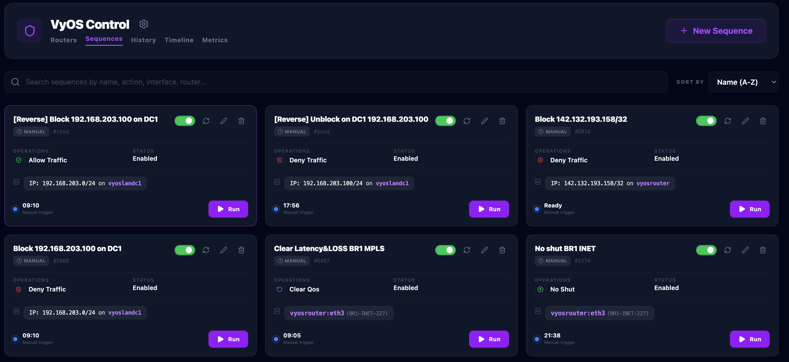
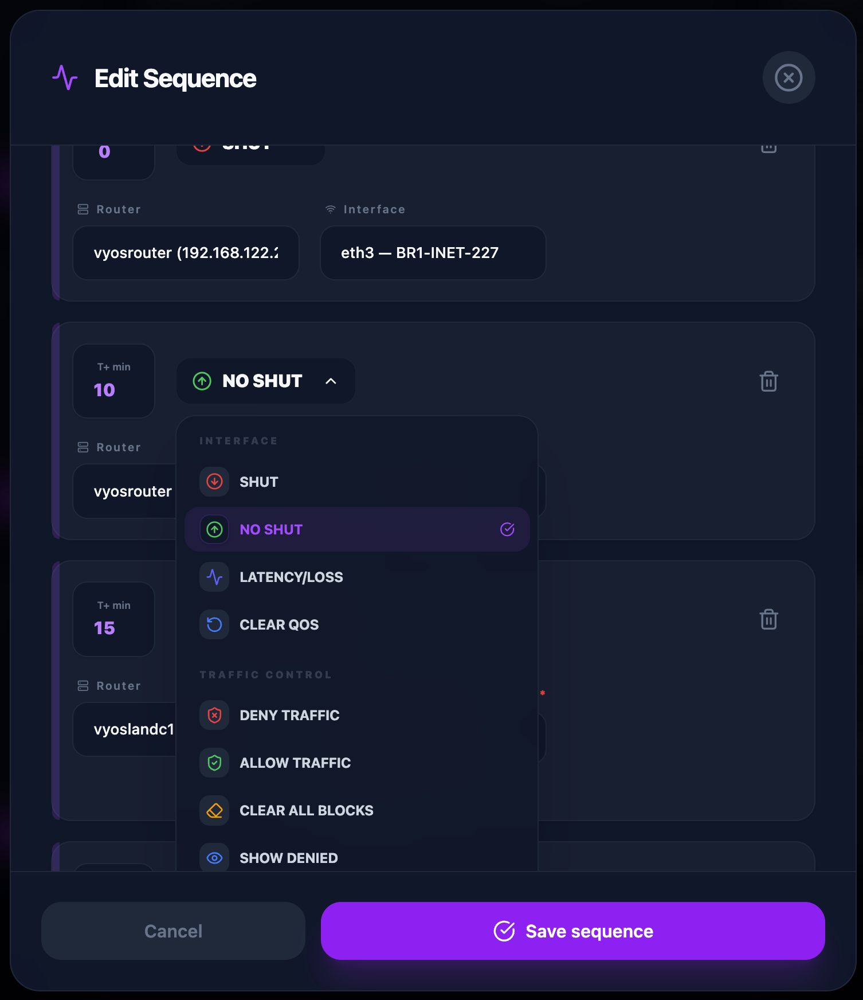
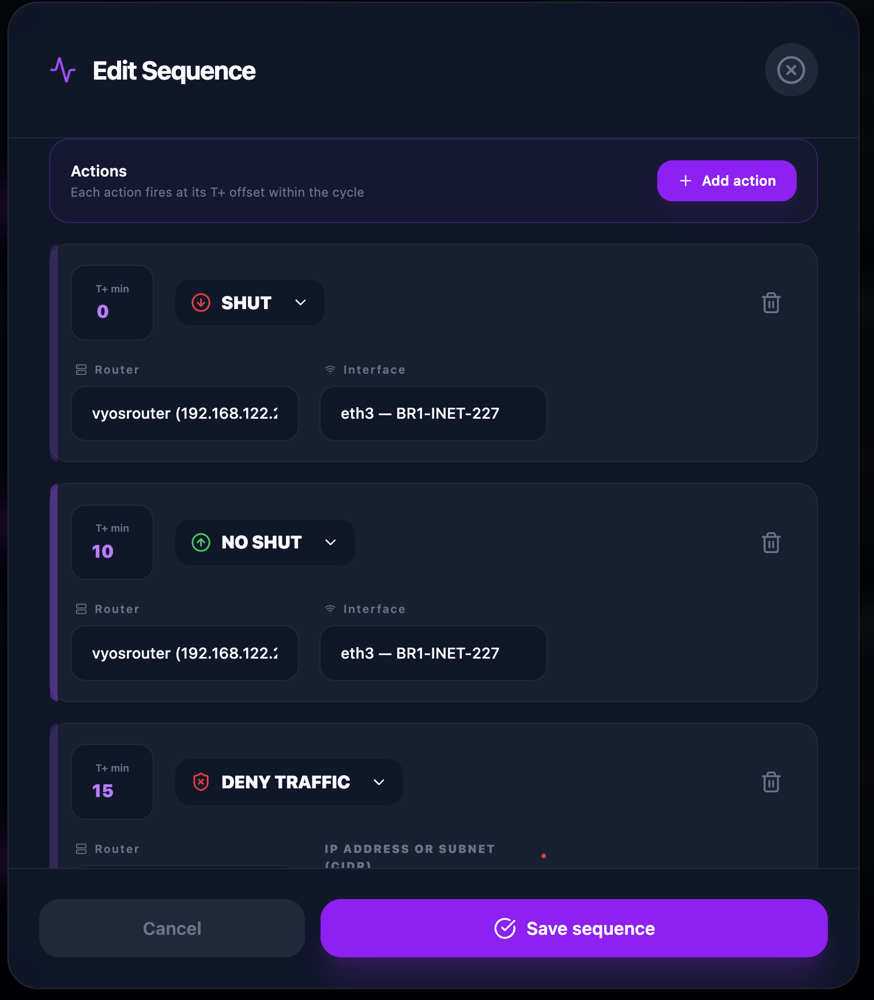
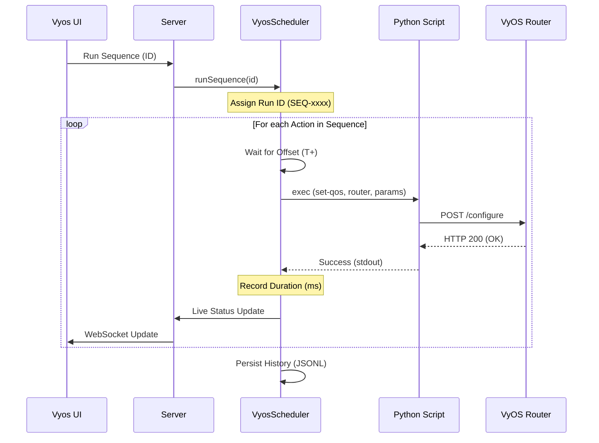
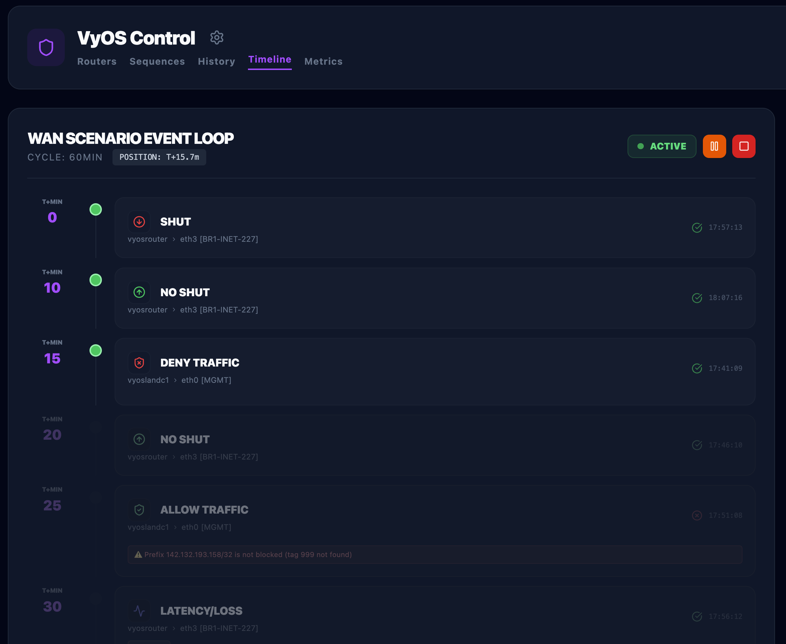
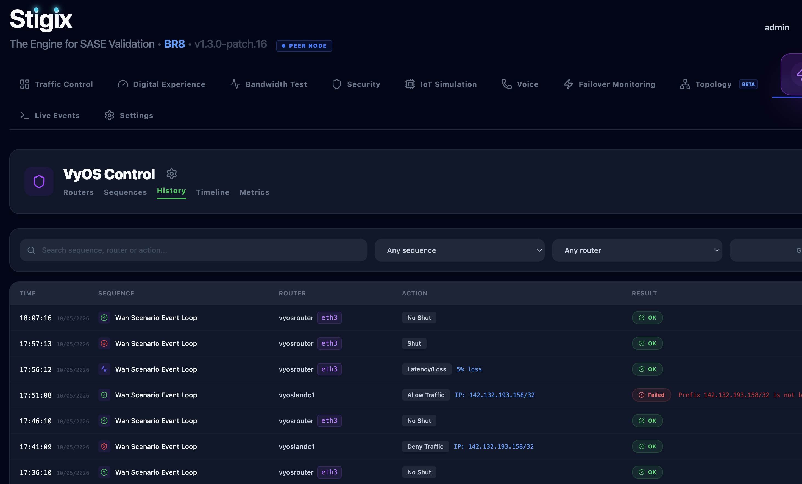

# VyOS Control - SD-WAN Impairment Simulation

The **VyOS Control** module is a specialized subsystem of the SD-WAN Traffic Generator designed to simulate network-level impairments on VyOS routers. It allows for highly orchestrated "missions" that can automate latency, packet loss, and rate-limiting across multiple SD-WAN paths.

*Central dashboard for discovering and managing VyOS nodes across the network:*





## 🚀 Core Features

- **Automated Router Discovery**: Connects via the VyOS HTTP API to retrieve interfaces, IP addresses, and operational descriptions.
- **Path Visibility**: Interface descriptions (e.g., "Paris to NYC MPLS") are promoted throughout the UI for rapid identification during troubleshooting.
- **Orchestrated Sequences**: Build multi-step impairment profiles with relative offsets (T+Minutes).
- **Scheduled Cycles**: Run missions manually or in cyclic loops (e.g., every 60 minutes) to create predictable network instability.
- **Audit Trails**: Detailed VoIP-style console logging and persistent JSONL history for post-mortem analysis.

*Library of pre-defined impairment sequences for automated lab testing:*



## 🛠️ Operational Workflow

### 1. Router Management
Add your VyOS nodes in the **Routers** tab.
- **Requirements**: VyOS 1.3+ with `service https` enabled and an API key.
- **Discovery**: The system automatically pulls interface data. You can then add a "Tactical Location" (e.g., "Branch 206") to organize your view.

*Comprehensive set of network control operations including interface flapping and QoS manipulation:*



### 2. Building Sequences
Create a "Sequence" to define your impairment mission.
- **Actions**: Each step in a sequence targets a specific router and interface.
- **Command**: Currently supports `SET-QOS` (latency, loss, rate) and `CLEAR-QOS`.
- **Offsets**: Define when an action happens relative to the start of the cycle (T+0, T+10, etc.).

*Advanced sequence editor for chaining complex impairment events with precise timing offsets:*





### 3. Monitoring Missions
- **Execution Timeline**: Watch actions trigger in real-time with status indicators.
- **Live Metrics**: Track total executions, success rates, and last-executed nodes.
- **Audit Logs**: Monitor the server console for structured run data.

*Real-time visualization of an active impairment mission loop tracking current progress and status:*



## 📜 Technical Deep-Dive

### Data Integrity & Constraints
- **Offset Clamping**: Action offsets are strictly clamped to the `cycle_duration`. If you reduce a cycle from 60 to 30 minutes, all offsets > 30 will be reactively clamped to 30.
- **Merge Logic**: Updates to router metadata (like location) are shallow-merged to preserve real-time status and interface detection.

### Structured Logging Format
The system uses unique **Run IDs** for every execution:
- `SEQ-xxxx`: For automated cyclic executions.
- `MAN-xxxx`: For manual triggers.

**Console Log Format:**
`[HH:MM:SS] [RUN-ID] ACTION_NAME COMMAND router:interface | params | STATUS (duration ms)`

*Example:*
`[14:30:05] [SEQ-0042] flap-eth0 SET-QOS Br206:eth1 | latency=50ms loss=2 | SUCCESS (125ms)`

### API & Performance
- **Scrubbing**: API keys are automatically scrubbed from all console logs and history files.
- **Duration Tracking**: The backend measures high-precision execution time (`performance.now()`) to help diagnose API latency issues on the router side.

*Searchable audit trail of every automated and manual action performed on the infrastructure:*



## ⚠️ Limitations & Notes
- **Exclusive Command**: The impairment logic uses a unified `set-qos` command on the back-end Python controller for stability.
- **API Rate Limits**: Rapidly triggering many actions (e.g., 50 per minute) may hit VyOS API constraints or cause delayed impairment application.
- **Persistence**: Sequences and history are persisted locally in `config/vyos-sequences.json` and `logs/vyos-history.jsonl`.

---

## 🤖 MCP Natural Language Control (Claude Desktop)

VyOS actions can be triggered via **plain English** from Claude Desktop, without touching the UI. This works through the Stigix MCP server, which translates Claude's tool calls into ad-hoc VyOS sequences.

> [!NOTE]
> Full MCP server setup, Claude Desktop configuration, and connection troubleshooting are documented in **[MCP_SERVER.md](MCP_SERVER.md)**.

### How It Works — Ad-hoc Sequence Lifecycle

When Claude executes a VyOS action (e.g. *"Add 200ms latency on the MPLS link of BR8"*), the MCP server follows this internal flow:

```
Claude Desktop (natural language)
        │
        ▼ Tool call: vyos_execute_action(agent_id, router_id, command, interface, latency_ms=200)
Stigix MCP Server
        │
        ├─ 1. POST /api/vyos/sequences          → create temp sequence (name: mcp-adhoc-<uuid>)
        ├─ 2. POST /api/vyos/sequences/run/<id> → execute immediately (run_id: MAN-xxxx)
        ├─ 3. GET  /api/vyos/history?limit=1    → retrieve cli_equivalent for confirmation
        └─ 4. DELETE /api/vyos/sequences/<id>   → clean up temp sequence
        │
        ▼ Returns to Claude: { success, cli_equivalent, run_id }
```

The sequence is **temporary** — it exists only for the duration of the execution and is deleted immediately after. However, the **history entry persists** in `vyos-history.jsonl`.

### Traceability — Actions in VyOS History

Every MCP-triggered action is fully traceable in the **VyOS Control → History** view:

| Field | Value |
|---|---|
| `sequence_name` | `mcp-adhoc-<uuid>` — identifies it as a Claude-triggered action |
| `run_id` | `MAN-xxxx` — manual execution counter |
| `command` | `set-latency`, `interface-down`, `deny-traffic`, etc. |
| `cli_equivalent` | exact VyOS CLI commands that were applied |
| `status` | `success` or `failed` |
| `duration_ms` | execution time |

This means you can audit every Claude action after the fact, just as you would for a manual or scheduled sequence.

### Propose & Confirm Workflow

Before executing any action, Claude always:

1. **Calls `get_vyos_interfaces`** → discovers all VyOS routers on the target node and their chaos-eligible interfaces (those with a description configured)
2. **Proposes a specific match** → *"I found eth1 (MPLS-Link-DC1) on vyoslandc1 — shall I apply 200ms latency to this interface?"*
3. **Waits for your confirmation** → no action is taken until you approve
4. **Executes via `vyos_execute_action`** → creates the ad-hoc sequence, runs it, returns the CLI equivalent

> [!IMPORTANT]
> **Interfaces without a description are silently excluded** from Claude's view — they are treated as management interfaces. Only interfaces with a configured description are considered chaos targets. See [Interface Naming Best Practices](#-interface-naming-best-practices-mcp--claude-desktop) below.

### Supported Actions via Natural Language

| What you say | VyOS command applied |
|---|---|
| *"Add 150ms latency on the MPLS link"* | `tc qdisc` netem delay 150ms |
| *"Set 5% packet loss on the WAN"* | `tc qdisc` netem loss 5% |
| *"Rate-limit the WAN to 10 Mbps"* | `tc qdisc` tbf rate 10mbit |
| *"Shut down the MPLS link"* | `set interfaces ethernet ethX disable` |
| *"Restore the MPLS link"* | `delete interfaces ethernet ethX disable` |
| *"Block traffic from 10.0.0.5"* | firewall rule deny source 10.0.0.5 |
| *"Remove all impairments on BR8"* | clear all `tc qdisc` rules on target interface |

### Multi-Router Support

If a node has multiple VyOS routers (e.g. `vyoslandc1`, `vyosbr1`, `vyosbr2`), Claude will:
- Query all routers via `get_vyos_interfaces`
- If the intent matches a unique interface across all routers → propose it directly
- If ambiguous (same description on two routers) → list both options and ask you to choose

---

## 🤖 Interface Naming Best Practices (MCP / Claude Desktop)

When using **Claude Desktop with the Stigix MCP Server**, Claude can control VyOS routers using natural language — *"Shut the MPLS link on BR1"*, *"Add 150ms latency on the WAN interface"*, *"Block IP 10.0.0.5"*.

For this to work, **interface descriptions must be configured on your VyOS routers**. Claude reads these descriptions to identify which physical interface matches your intent.

### ✅ Good description format

Use a clear, keyword-rich format:

```
set interfaces ethernet eth0 description "WAN-Internet-Bouygues"
set interfaces ethernet eth1 description "MPLS-Link-DC1"
set interfaces ethernet eth2 description "LAN-Users-Branch"
set interfaces ethernet eth3 description "4G-Backup-SFR"
```

### 📋 Recommended naming convention

```
{LINK-TYPE}-{PURPOSE}-{DESTINATION}
```

| Example description | What Claude understands |
|---|---|
| `WAN-Internet-Bouygues` | "WAN", "internet", "Bouygues" |
| `MPLS-Link-DC1` | "MPLS", "DC1", "datacenter" |
| `LAN-Users-Branch` | "LAN", "users", "local" |
| `4G-Backup-SFR` | "4G", "backup", "SFR" |
| `IPSEC-VPN-Paris` | "VPN", "Paris", "tunnel" |

### ❌ What NOT to do

```
# Bad — Claude cannot identify these
set interfaces ethernet eth0 description "eth0"
set interfaces ethernet eth1 description "interface 1"
# Or no description at all
```

### ⚠️ Without descriptions

If no descriptions are configured, Claude will:
1. List all interfaces with names and IPs
2. Warn the user that natural language targeting is unavailable
3. Ask the user to specify the interface name explicitly (e.g. `eth1`)

### How to configure on VyOS

```bash
configure
set interfaces ethernet eth0 description "WAN-Internet-Provider"
set interfaces ethernet eth1 description "MPLS-Link-DC1"
commit
save
exit
```

Then click **Refresh** in the Stigix dashboard to sync the updated interface list.

---

## ✅ MCP Session — Validated Behaviors (30/05/2026)

The following interactions were tested live against a production Stigix instance (BR8-Ubuntu gateway, `vyosrouter` and `vyoslandc1`). All actions executed successfully and appear in the **VyOS Control → History** tab with `status=OK` and `cli_equivalent`.

### Topology tested
```
Claude Desktop → stigix-br8 (MCP) → Stigix BR8-Ubuntu
                                          │
                                          ├─ vyosrouter  → VyOS Router → BR1, BR2
                                          │     eth1 — BR1-MPLS-197
                                          │     eth3 — BR1-INET-227
                                          │     eth7 — BR2-INET-226
                                          │     eth8 — BR2-MPLS-196
                                          │
                                          └─ vyoslandc1 / vyoslandc2new → DC1, DC2
```

### Confirmed working interactions

| Prompt | Action | Result |
|---|---|---|
| *"Add 300ms latency on the BR2 internet link"* | `set-impairment` → eth7 BR2-INET-226 | ✅ |
| *"Remove it"* | `clear-qos` → eth7 | ✅ |
| *"Add 5% packet loss on the MPLS of BR2"* | `set-impairment (loss)` → eth8 BR2-MPLS-196 | ✅ |
| *"Add 300ms latency on MPLS and internet of BR2 at the same time"* | 2× `set-impairment` → eth8 + eth7 | ✅ |
| *"Add 5% packet loss on internet of BR1 and BR2"* | 2× `set-impairment (loss)` → eth3 + eth7 | ✅ |
| *"Block IP 1.2.3.4 on DC1"* | `deny-traffic` → vyoslandc1 | ✅ |
| *"Unblock 1.2.3.4, then block 4.3.2.1 on DC1 and DC2"* | `allow-traffic` + 2× `deny-traffic` | ✅ |
| *"Unblock 4.3.2.1 on DC1 and DC2"* | 2× `allow-traffic` | ✅ |
| *"Shut MPLS on BR1, wait 5 seconds, then restore — no confirm between steps"* | `interface-down` → sleep 5s → `interface-up` | ✅ |

### Key behaviors validated

- **Site name resolution** : Claude correctly maps `"BR2 internet"` → `eth7 BR2-INET-226` by scanning interface descriptions — no agent ID confusion.
- **Propose-confirm workflow** : Claude always proposes the exact router + interface + action before executing. User confirms once, then action runs.
- **Multi-interface in one call** : Claude groups multi-interface requests into a single confirmation block and executes all in sequence.
- **Firewall without interface** : `deny-traffic` / `allow-traffic` correctly target the router without requiring an interface (firewall applies router-wide). Claude asks which router when multiple match.
- **Automated sequence** : shutdown → wait → restore executed without intermediate confirmations after the initial user `yes`.
- **Full history traceability** : All MCP actions appear in VyOS History as `MCP: <command>:<iface> on <router>` with the actual VyOS CLI equivalent.

### Prompt best practices

- ✅ Reference sites by interface description keywords: `"BR1 internet"`, `"BR2 MPLS"`, `"DC1"`
- ✅ Don't say `"On BR8, ..."` — BR8 is the MCP gateway, not the VyOS router. It creates ambiguity.
- ✅ Say `"Block IP X on DC1"` — Claude will identify the firewall router for that site.
- ✅ For multi-step sequences without confirmation: `"... do X then Y without asking between steps"`
```
