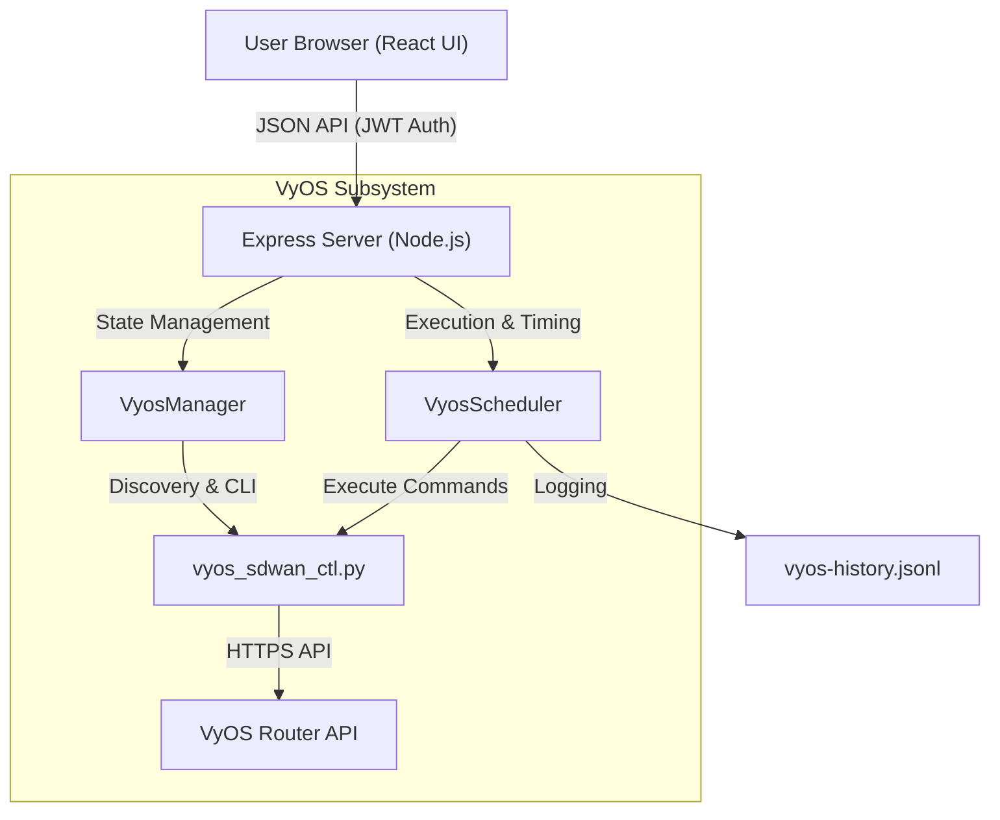
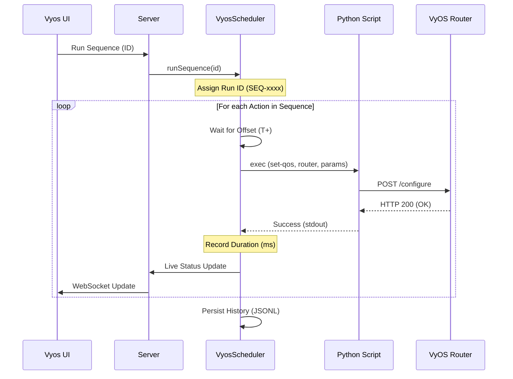

# VyOS Control - SD-WAN Impairment Simulation

The **VyOS Control** module is a specialized subsystem of the SD-WAN Traffic Generator designed to simulate network-level impairments on VyOS routers. It allows for highly orchestrated "missions" that can automate latency, packet loss, and rate-limiting across multiple SD-WAN paths.

*Central dashboard for discovering and managing VyOS nodes across the network:*

## 🚀 Core Features

- **Automated Router Discovery**: Connects via the VyOS HTTP API to retrieve interfaces, IP addresses, and operational descriptions.
- **Path Visibility**: Interface descriptions (e.g., "Paris to NYC MPLS") are promoted throughout the UI for rapid identification during troubleshooting.
- **Orchestrated Sequences**: Build multi-step impairment profiles with relative offsets (T+Minutes).
- **Scheduled Cycles**: Run missions manually or in cyclic loops (e.g., every 60 minutes) to create predictable network instability.
- **Audit Trails**: Detailed VoIP-style console logging and persistent JSONL history for post-mortem analysis.

*Library of pre-defined impairment sequences for automated lab testing:*

## 🛠️ Operational Workflow

### 1. Router Management
Add your VyOS nodes in the **Routers** tab.
- **Requirements**: VyOS 1.3+ with `service https` enabled and an API key.
- **Discovery**: The system automatically pulls interface data. You can then add a "Tactical Location" (e.g., "Branch 206") to organize your view.

*Comprehensive set of network control operations including interface flapping and QoS manipulation:*

### 2. Building Sequences
Create a "Sequence" to define your impairment mission.
- **Actions**: Each step in a sequence targets a specific router and interface.
- **Command**: Currently supports `SET-QOS` (latency, loss, rate) and `CLEAR-QOS`.
- **Offsets**: Define when an action happens relative to the start of the cycle (T+0, T+10, etc.).

*Advanced sequence editor for chaining complex impairment events with precise timing offsets:*

### 3. Monitoring Missions
- **Execution Timeline**: Watch actions trigger in real-time with status indicators.
- **Live Metrics**: Track total executions, success rates, and last-executed nodes.
- **Audit Logs**: Monitor the server console for structured run data.

*Real-time visualization of an active impairment mission loop tracking current progress and status:*

## 📜 Technical Deep-Dive

### Data Integrity & Constraints
- **Offset Clamping**: Action offsets are strictly clamped to the `cycle_duration`. If you reduce a cycle from 60 to 30 minutes, all offsets > 30 will be reactively clamped to 30.
- **Merge Logic**: Updates to router metadata (like location) are shallow-merged to preserve real-time status and interface detection.

### Structured Logging Format
The system uses unique **Run IDs** for every execution:
- `SEQ-xxxx`: For automated cyclic executions.
- `MAN-xxxx`: For manual triggers.

**Console Log Format:**
`[HH:MM:SS] [RUN-ID] ACTION_NAME COMMAND router:interface | params | STATUS (duration ms)`

*Example:*
`[14:30:05] [SEQ-0042] flap-eth0 SET-QOS Br206:eth1 | latency=50ms loss=2 | SUCCESS (125ms)`

### API & Performance
- **Scrubbing**: API keys are automatically scrubbed from all console logs and history files.
- **Duration Tracking**: The backend measures high-precision execution time (`performance.now()`) to help diagnose API latency issues on the router side.

*Searchable audit trail of every automated and manual action performed on the infrastructure:*

## ⚠️ Limitations & Notes
- **Exclusive Command**: The impairment logic uses a unified `set-qos` command on the back-end Python controller for stability.
- **API Rate Limits**: Rapidly triggering many actions (e.g., 50 per minute) may hit VyOS API constraints or cause delayed impairment application.
- **Persistence**: Sequences and history are persisted locally in `config/vyos-sequences.json` and `logs/vyos-history.jsonl`.
